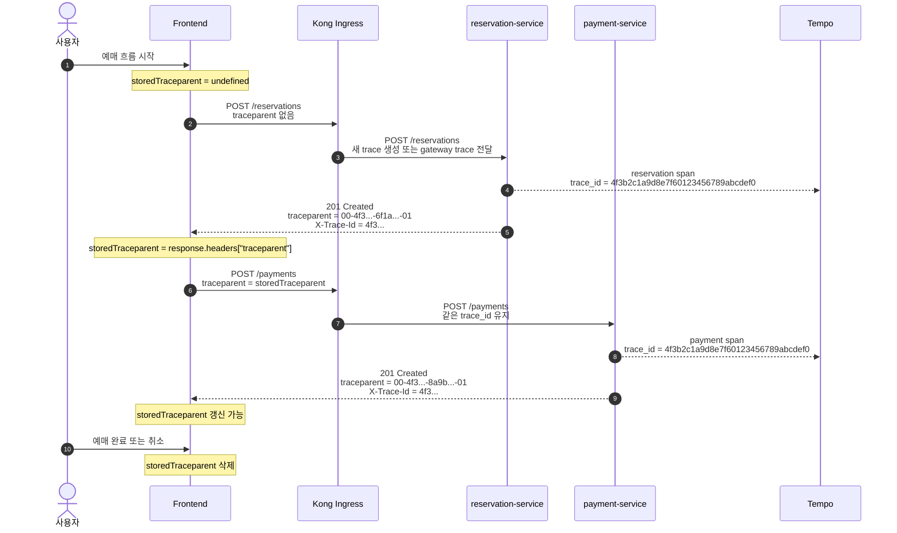

# Frontend traceparent 처리 가이드

이 문서는 프론트엔드가 Kong Ingress를 통해 MSA를 직접 호출할 때 `traceparent`를 어떻게 주고받는지 정리한다. 현재 계약에서는 클라이언트가 첫 `traceparent`를 직접 만들지 않는다. `traceparent`가 없으면 서버 경계에서 만들고, 있으면 관측성 상관관계 목적으로만 이어받는다.

## 처리 원칙

- 첫 API 요청에는 `traceparent`를 보내지 않아도 된다.
- 서버는 요청에 유효한 `traceparent`가 있으면 이어받고, 없거나 형식이 잘못됐으면 새 trace를 만든다.
- 서버는 응답 header에 현재 요청의 `traceparent`, `X-Trace-Id`, `X-Request-Id`를 내려준다.
- 클라이언트는 같은 예매 흐름 안에서 응답으로 받은 `traceparent`를 후속 API 요청에 릴레이한다.
- 클라이언트와 서버는 `traceparent`를 인증, 권한, 감사 로그 판단 기준으로 사용하지 않는다.
- 사용자 신뢰와 권한 판단은 JWT를 기준으로 한다.
- 서버의 sampling 정책은 클라이언트가 보낸 `traceparent`의 sampled flag보다 우선한다.
- `tracestate`는 1차 계약에서 사용하지 않는다.
- `traceparent`는 화면 새로고침, 로그아웃, 예매 흐름 종료, 취소 시 버린다.

## Header 계약

### Client -> Server

```http
Authorization: Bearer <access_token>
traceparent: 00-4f3b2c1a9d8e7f60123456789abcdef0-6f1a2b3c4d5e6f70-01
```

`traceparent`는 저장된 값이 있을 때만 보낸다. 첫 요청이거나 저장된 값이 없으면 생략한다.

### Server -> Client

```http
traceparent: 00-4f3b2c1a9d8e7f60123456789abcdef0-6f1a2b3c4d5e6f70-01
X-Trace-Id: 4f3b2c1a9d8e7f60123456789abcdef0
X-Request-Id: 0e6f2b3d-5f89-4b77-98d8-0ecab7359181
```

프론트엔드는 `traceparent` 전체 문자열을 저장한다. `X-Trace-Id`는 화면 오류 신고나 개발자 도구 표시용으로만 사용한다.

### CORS

브라우저에서 header를 읽고 보낼 수 있으려면 서버 또는 gateway가 다음 header를 허용해야 한다.

```http
Access-Control-Allow-Headers: Authorization, Content-Type, traceparent
Access-Control-Expose-Headers: traceparent, X-Trace-Id, X-Request-Id
```

## 보안 경계

`traceparent`는 신뢰 경계 밖의 입력이다. 브라우저, k6, curl, 외부 클라이언트는 임의의 `traceparent`를 보낼 수 있다.

따라서 서버는 다음 기준을 지킨다.

- 형식이 잘못된 `traceparent`는 폐기하고 새 trace를 만든다.
- 유효한 `traceparent`라도 관측성 상관관계 목적으로만 이어받는다.
- sampled flag, `tracestate`, 기타 trace 관련 header를 보안 정책의 입력으로 쓰지 않는다.
- 사용자 식별, 권한, 감사 로그의 신뢰 근거는 JWT와 서버가 검증한 업무 데이터다.
- `X-Trace-Id`와 `X-Request-Id`는 화면 오류 신고와 로그 검색을 돕는 보조 ID로만 쓴다.

## JSON 예시

### 첫 예약 요청

첫 요청에는 아직 저장된 `traceparent`가 없으므로 header에서 생략한다.

```json
{
  "request": {
    "method": "POST",
    "url": "/reservations",
    "headers": {
      "Authorization": "Bearer <access_token>",
      "Content-Type": "application/json"
    },
    "body": {
      "concert_id": "concert-2026-06-10",
      "seat_id": "A-10"
    }
  }
}
```

서버는 새 trace를 만들고 응답 header로 내려준다.

```json
{
  "response": {
    "status": 201,
    "headers": {
      "traceparent": "00-4f3b2c1a9d8e7f60123456789abcdef0-6f1a2b3c4d5e6f70-01",
      "X-Trace-Id": "4f3b2c1a9d8e7f60123456789abcdef0",
      "X-Request-Id": "0e6f2b3d-5f89-4b77-98d8-0ecab7359181"
    },
    "body": {
      "reservation_id": "0f8fad5b-d9cb-469f-a165-70867728950e",
      "status": "HELD",
      "expires_at": "2026-06-10T12:05:00Z"
    }
  }
}
```

### 후속 결제 요청

같은 예매 흐름에서 결제를 호출할 때는 저장한 `traceparent`를 보낸다.

```json
{
  "request": {
    "method": "POST",
    "url": "/payments",
    "headers": {
      "Authorization": "Bearer <access_token>",
      "Content-Type": "application/json",
      "traceparent": "00-4f3b2c1a9d8e7f60123456789abcdef0-6f1a2b3c4d5e6f70-01"
    },
    "body": {
      "reservation_id": "0f8fad5b-d9cb-469f-a165-70867728950e",
      "amount": 66000,
      "currency": "KRW"
    }
  }
}
```

서버는 같은 `trace_id`를 유지하되 새 span으로 처리한다.

```json
{
  "response": {
    "status": 201,
    "headers": {
      "traceparent": "00-4f3b2c1a9d8e7f60123456789abcdef0-8a9b0c1d2e3f4051-01",
      "X-Trace-Id": "4f3b2c1a9d8e7f60123456789abcdef0",
      "X-Request-Id": "4a1f6c99-a1f6-4959-b4d6-3ec10bb74a2a"
    },
    "body": {
      "payment_id": "7c9e6679-7425-40de-944b-e07fc1f90ae7",
      "reservation_id": "0f8fad5b-d9cb-469f-a165-70867728950e",
      "status": "APPROVED"
    }
  }
}
```

## 시퀀스



## 프론트엔드 구현 체크리스트

- 예매 흐름 단위로 메모리 상태에 `storedTraceparent`를 둔다.
- 요청 전 `storedTraceparent`가 있으면 `traceparent` header에 넣는다.
- 응답 후 `traceparent` header가 있으면 `storedTraceparent`를 갱신한다.
- `localStorage`에 저장하지 않는다.
- `tracestate`는 저장하거나 전송하지 않는다.
- `traceparent`를 사용자 식별, 권한, 감사 로그 판단에 사용하지 않는다.
- `traceparent`가 없거나 CORS 때문에 읽지 못해도 사용자 기능은 실패시키지 않는다.
- 병렬 요청이 첫 응답보다 먼저 나가면 trace가 나뉠 수 있다. 이 경우 기능 재시도나 요청 재발행은 하지 않는다.
