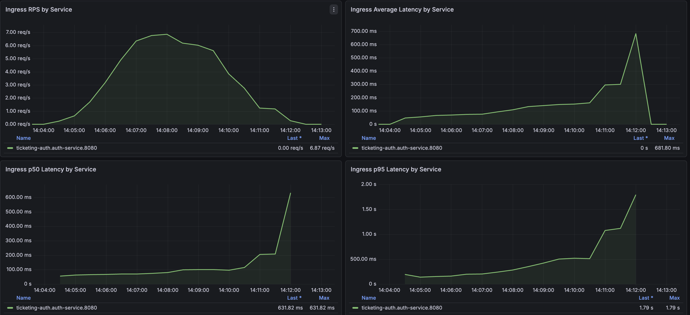
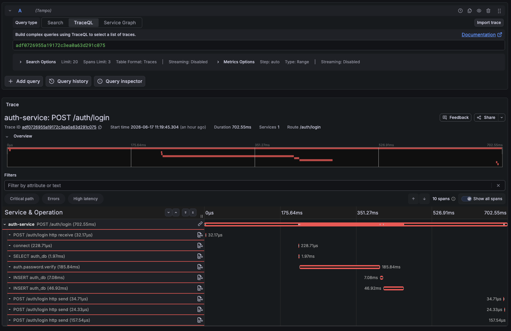

# Auth Service Loadtest Bottleneck

## Summary

2026-06-16부터 2026-06-17까지 진행한 `reservation-journey-load-test`와 `auth-login-load-test` 결과를 기준으로 auth-service의 병목을 정리한다.

핵심 결론은 `/auth/login`이 일반 조회 API와 성격이 다른 CPU-bound 경로라는 점이다. auth-service는 로그인마다 `PBKDF2-SHA256` password verification을 수행하고, 현재 기본 반복 횟수는 `AUTH_PASSWORD_ITERATIONS=210000`이다. 이 비용은 보안상 의도된 비용이므로 단순히 낮추기보다 로그인 트래픽을 별도 용량 기준으로 보고, rate limit과 backoff로 극단적인 부하를 제어하는 방향이 맞다.

다만 이번 실험에서 보인 실패는 PBKDF2 하나로만 설명되지 않는다. 부하 조건에서는 SQLAlchemy connection pool과 auth-db `max_connections` 사이의 connection budget 불일치도 함께 드러났다. 따라서 개선 방향은 `비밀번호 검증 비용을 보안 기준 안에서 유지한다`, `로그인 부하를 별도 정책으로 제한한다`, `DB connection budget을 서비스별로 명시한다`, `계측으로 두 병목을 분리해서 본다`로 잡는다.

## Source Evidence

| 구분 | 근거 |
| --- | --- |
| trouble | [TROUBLE-010: 부하테스트 중 auth login trace의 미계측 지연 구간](../../../trouble/2026-06-16-auth-login-trace-latency-under-load.md) |
| loadtest evidence | [Reservation Journey Loadtest: Auth Bottleneck](../../loadtest/reservation-journey-auth-bottleneck/README.md) |
| trace capture | [auth login trace latency](assets/2026-06-16-auth-login-trace-latency.png) |
| latency graph | [auth login latency graph](assets/2026-06-16-auth-login-trace-latency-graphs.png) |
| password span capture | [auth login password verify span](assets/2026-06-16-auth-login-trace-latency-password-span.png) |
| profile capture | [auth login flame graph and connection error](assets/2026-06-17-auth-login-trace-flamegraph-too-many-clients.png) |
| Argon2id benchmark | [Argon2id password verify benchmark](2026-06-20-argon2id-password-verify-benchmark.md) |
| PBKDF2 RPS benchmark | [PBKDF2 concurrency RPS benchmark](2026-06-20-pbkdf2-concurrency-rps-benchmark.md) |

## Evidence Captures

### Auth login trace latency


### Auth login latency graph



### Auth password verify span



### Auth login flame graph and connection error


## Run Reading

| 항목 | 관찰 |
| --- | --- |
| reservation journey run | `50 VU`, `6m`, think time `0s`, 전체 RPS 약 `59` |
| 전체 실패율 | `34%` |
| 실패 집중 지점 | `reservation_journey.auth.login` 503이 `3395`건 |
| Kong evidence | `ticketing-auth/auth-service` upstream target 없음 메시지 반복 |
| auth-service CPU | Pod CPU max `0.4989 core`, 당시 limit `500m`에 거의 도달 |
| auth-service access log | `/auth/login` 평균 `2014.9ms`, 최대 `8488ms` |
| auth login 단독 run | `2093` requests, `22.08 rps`, error `0`, p95 `116.10ms`, p99 `512.67ms` |
| trace evidence | `auth-service: POST /auth/login` duration `795.59ms`, 표시된 DB/connect span 합계는 약 `202.17ms` |
| profile/exception evidence | `psycopg.OperationalError`, PostgreSQL `FATAL: sorry, too many clients already` |

## Prometheus Metric Reading

| 관점 | 판정 | 근거 | 해석 |
| --- | --- | --- | --- |
| CPU | 병목 후보 | auth-service Pod CPU max가 `0.4989 core`로 `500m` limit에 거의 도달 | PBKDF2 password verification이 요청마다 CPU를 사용하므로 login 부하가 몰릴 때 latency 하한선을 만든다. |
| 메모리 | 이번 증거로는 1차 병목 아님 | 관련 run에서 OOMKilled, restart 증가, memory limit 근접 증거가 핵심 근거로 기록되지 않음 | 메모리보다 CPU, readiness, DB connection budget 쪽 근거가 강하다. 다음 run에서는 `container_memory_working_set_bytes`와 OOMKilled 여부를 함께 캡처한다. |
| 네트워크 I/O | 이번 증거로는 1차 병목 아님 | Kong 503은 네트워크 대역폭 부족보다 upstream target 없음과 readiness 흔들림으로 해석됨 | `/auth/login` payload는 작고, 실패 지점도 auth-service readiness와 DB connection 쪽에 맞춰져 있다. 다음 run에서는 RX/TX rate를 보조 지표로만 확인한다. |
| DB connection | 병목 후보 | `too many clients already`, SQLAlchemy/psycopg connection stack, connection span `144.24ms` | query 자체가 느리다기보다 connection checkout/connect와 DB connection 한도가 부하 조건에서 먼저 문제를 만든다. |
| Gateway/Readiness | 증상 | Kong `No targets could be found`, auth Pod readiness/liveness timeout | login latency 증가가 health 응답 지연으로 번지고, Kong이 target을 잃으면서 503이 늘어난다. |

## Root Cause

### 1. Password Verification CPU Cost

auth-service의 `/auth/login`은 사용자 조회 뒤 `verify_password()`에서 `hashlib.pbkdf2_hmac("sha256", ..., 210000)`을 실행한다. PBKDF2 반복 횟수는 보안 비용을 의도적으로 만드는 설정이다.

부하테스트에서는 매 iteration마다 login이 실행되었고, 이 조건은 실제 서비스의 일반 API 호출 패턴보다 로그인 비중을 크게 만든다. 그 결과 reservation, payment, ticket 경로의 처리량을 보기 전에 auth-service가 먼저 포화됐다.

중요한 점은 이 비용을 "없애야 할 병목"으로만 보면 안 된다는 것이다. 로그인은 속도보다 보안 안정성이 우선인 경계다. 반복 횟수를 낮추는 결정은 인증 보안 기준, 계정 탈취 방어, 운영 피크 가정, CPU/replica 비용을 함께 비교한 뒤에만 검토한다.

### 2. DB Connection Budget Mismatch

trace와 profile을 더 본 뒤에는 DB connection budget 문제도 같이 확인됐다.

- auth-db `max_connections=20`인 상태에서 auth-service replica와 SQLAlchemy 기본 pool 조합은 이 한도를 초과할 수 있었다.
- span profile에는 SQLAlchemy pool과 psycopg connection stack이 보였다.
- exception event에는 PostgreSQL이 새 연결을 거절한 `too many clients already`가 기록됐다.
- concert-service에서도 `QueuePool limit of size 5 overflow 0 reached`가 관측되어, 서비스 공통 pool sizing 문제로 확장해서 봐야 한다.

따라서 auth-service의 병목은 `PBKDF2 CPU 비용`과 `DB connection budget` 두 축이다. 전자는 보안 비용으로 받아들이고 용량/제어 정책을 둔다. 후자는 서비스별로 수식화해서 운영 한도 안에 들어오도록 맞춘다.

## What This Experiment Proves

- `reservation-journey-load-test`는 50 VU 조건에서 auth-service login 병목을 재현했다.
- Kong rate limit 429가 이번 실패의 핵심 원인은 아니다.
- auth-service는 CPU limit에 가까워졌고, `/auth/login` tail latency가 초 단위로 늘었다.
- readiness/liveness timeout과 Kong upstream target 없음이 함께 관측되어 503의 직접 증상으로 이어졌다.
- auth-service CPU/replica를 올린 뒤에도 login 병목이 남아 단순 리소스 부족만으로 설명하기 어렵다.
- `auth-login-load-test`는 signup/setup 비용을 분리하고 `/auth/login`만 측정할 수 있게 만들었다.
- `auth.password.verify` span은 PBKDF2 검증 구간을 root span 안에서 분리해 볼 수 있게 한다.

## What This Experiment Does Not Prove

- PBKDF2 반복 횟수를 낮춰야 한다는 결론은 아니다.
- DB query 자체가 느리다는 결론은 아니다. 현재 근거는 query latency보다 connection checkout/connect와 connection limit 쪽이 강하다.
- 메모리나 네트워크 I/O가 병목이라는 결론은 아니다.
- 60 login/s 빠른 ramp-up에서 error가 없었다고 해서 auth capacity가 충분하다는 결론은 아니다. p99 `512.67ms` tail latency가 이미 보였다.
- readiness timeout을 늘리는 것은 증상 완화일 수 있지만, login CPU 비용이나 connection budget 문제를 해결하지는 않는다.

## Improvement Direction

| 방향 | 결정 | 이유 |
| --- | --- | --- |
| Rate limit / backoff | 우선 적용 | 로그인은 평시 빈도가 낮고, 실패 로그인이나 폭주 상황은 보안 정책으로 제어하는 편이 자연스럽다. |
| PBKDF2 iteration 하향 | 기본 개선책으로 보지 않음 | 속도보다 보안 안정성이 우선이며, 반복 횟수는 단순 성능 튜닝 값이 아니다. |
| Auth login capacity 분리 | 필요 | `/auth/login`은 일반 read API와 같은 RPS 목표를 적용하지 않는다. 평시 login RPS, 피크 login RPS, 실패 로그인 RPS를 따로 둔다. |
| DB pool budget 명시 | 필요 | `replicas * (pool_size + max_overflow)`가 DB `max_connections`와 운영 여유분 안에 들어오도록 서비스별로 계산한다. |
| Login 포함/제외 run 분리 | 필요 | reservation/payment/ticket 한계치를 보려면 token pre-warm 또는 login 제외 시나리오가 필요하다. |
| 내부 span/metric 확장 | 필요 | `auth.password.verify`, user lookup, token issue, refresh token insert, audit insert/commit을 나눠 p95/p99 원인을 분리한다. |

## Service Policy

운영 기준은 다음 순서로 잡는다.

1. `/auth/login`은 보안 경계이므로 password verification 비용을 정상 비용으로 본다.
2. 정상 사용자의 로그인 UX는 p95/p99 목표를 따로 둔다.
3. 비정상적인 반복 로그인, credential stuffing, 짧은 시간의 계정별 실패는 rate limit과 backoff로 제어한다.
4. 예매/티켓 같은 본 서비스 처리량 실험은 login 부하와 분리한다.
5. DB connection pool은 서비스별 DB 한도와 replica/HPA 계획을 기준으로 계산한다.

## Follow-up Checks

| 우선순위 | 확인 | 기준 |
| --- | --- | --- |
| P0 | bounded pool 적용 후 동일 부하 재실행 | `too many clients already`, `QueuePool timeout`, Kong 503 감소 여부 |
| P0 | `auth.password.verify` p95/p99 확인 | `/auth/login` p95/p99와 같은 방향으로 움직이는지 |
| P1 | CPU/replica 조합별 auth-login run | p95, p99, error rate, readiness failure 비교 |
| P1 | 메모리/네트워크 보조 지표 캡처 | `container_memory_working_set_bytes`, OOMKilled, RX/TX rate가 병목 후보인지 배제 |
| P1 | rate limit 정책 실험 | IP/account 단위 실패 로그인 제한, backoff 적용 시 auth-service CPU 보호 효과 |

## PromQL Notes

다음 query는 이후 run에서 auth-service 병목 판단 표를 채울 때 사용한다.

### CPU usage

```promql
max by (namespace, pod, container) (
  rate(container_cpu_usage_seconds_total{
    namespace="ticketing-auth",
    container="auth-service"
  }[5m])
)
```

### CPU throttling ratio

```promql
sum by (namespace, pod, container) (
  rate(container_cpu_cfs_throttled_seconds_total{
    namespace="ticketing-auth",
    container="auth-service"
  }[5m])
)
/
sum by (namespace, pod, container) (
  rate(container_cpu_cfs_periods_total{
    namespace="ticketing-auth",
    container="auth-service"
  }[5m])
)
```

### Memory working set

```promql
max by (namespace, pod, container) (
  container_memory_working_set_bytes{
    namespace="ticketing-auth",
    container="auth-service"
  }
)
```

### Network RX/TX

```promql
sum by (namespace, pod) (
  rate(container_network_receive_bytes_total{
    namespace="ticketing-auth",
    pod=~"auth-service-.*"
  }[5m])
)
```

```promql
sum by (namespace, pod) (
  rate(container_network_transmit_bytes_total{
    namespace="ticketing-auth",
    pod=~"auth-service-.*"
  }[5m])
)
```
