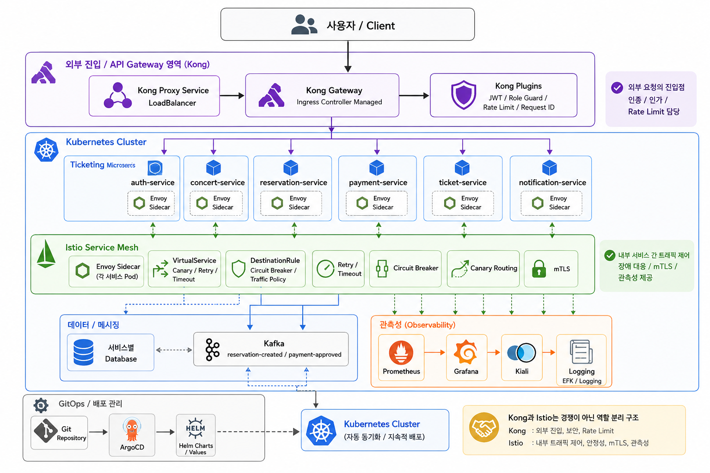

## 요청 흐름

1. 사용자/Client가 외부 API를 호출합니다.
2. Kong Proxy Service가 LoadBalancer 역할로 외부 요청을 받습니다.
3. Kong Gateway가 Ingress 규칙에 따라 /auth, /concerts, /reservations, /payments, /tickets, /notifications 경로를 각 Kubernetes Service로 라우팅합니다.
4. Kong 내부 Plugin이 JWT 검증, Role Guard, Rate Limit, Request ID 부여를 수행합니다.
5. 요청은 Kubernetes ClusterIP Service를 통해 대상 서비스 Pod로 전달됩니다.
6. Istio sidecar injection이 적용된 서비스는 Envoy Sidecar를 통해 inbound/outbound 트래픽을 처리합니다.
7. 서비스 간 내부 호출은 Istio VirtualService/DestinationRule 정책에 따라 retry, timeout, circuit breaker, canary routing을 적용받습니다.
8. 예약 생성, 결제 승인 같은 비동기 흐름은 Kafka 이벤트로 전달되고 ticket-service, notification-service가 이를 소비합니다.
9. Prometheus/Grafana/Kiali/Logging이 메트릭, 토폴로지, 로그를 수집하여 운영 증거를 제공합니다.

## 배포 흐름

1. 서비스 코드가 변경되면 CI에서 테스트와 이미지 빌드를 수행합니다.
2. 이미지는 로컬/원격 Container Registry에 push됩니다.
3. GitOps 레포의 Helm values 또는 manifest에 이미지 태그와 라우팅/정책 변경을 반영합니다.
4. ArgoCD가 Git 상태를 감지하고 Kubernetes 클러스터에 동기화합니다.
5. Helm Chart는 서비스별 Deployment, Service, HPA, PDB, Kong/Istio 관련 리소스를 일관된 템플릿으로 배포합니다.
6. 배포 이후 Prometheus, Grafana, Kiali, Logging으로 정상 동작 여부를 검증합니다.
