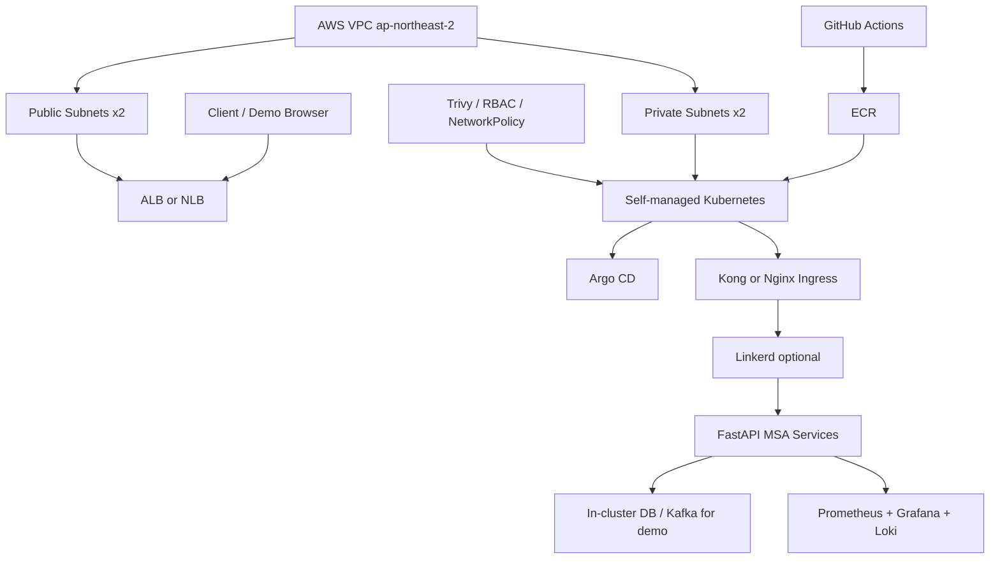

# KT CloudNative Study AWS 인프라 사전 산정

## 문서 목적

이 문서는 Notion 자료조사 추출본과 `../plan/02-PROJECT_PLAN.md`, `../plan/05-scenarios/README.md`, `../workplans/05-aws-demo-environment.yaml`을 기준으로 AWS demo/QA 환경에 필요한 인프라를 미리 정리한다.

목표는 운영 환경 수준의 정확한 견적을 내는 것이 아니다. 5주 심화 프로젝트에서 최종 시연과 검증 결과를 남길 수 있는 최소 실행 환경을 정하는 데 있다.

## 현재 전제

- 최종 시연은 AWS demo/QA 단일 환경을 우선한다.
- dev/QA/prod 완전 분리는 이번 범위에서 제외한다.
- `../plan/00-PRD.md`의 기본 프로젝트 요구사항은 심화 프로젝트의 선행 조건으로 이어서 가져가되, AWS 배포 시점에는 실제로 확인할 수 있는 실행 결과가 있는지 다시 본다.
- 기본 프로젝트의 MSA와 Kubernetes 배포 기반을 이어받는다.
- GitOps는 Argo CD + Helm을 우선한다.
- 관측성은 Prometheus, Grafana, Loki를 우선하고 Tempo는 여력에 따라 판단한다.
- Gateway는 Kong 또는 Nginx Ingress 중 하나만 먼저 고른다.
- Service Mesh는 Linkerd 우선, Istio는 고급 트래픽 제어를 발표 핵심으로 넣을 때만 선택한다.
- DevSecOps는 Trivy config/image scan과 RBAC, ServiceAccount, NetworkPolicy를 우선한다.
- Kubernetes는 EKS를 제외하고, EC2 위에 Ansible/kubeadm으로 직접 구성하는 self-managed Kubernetes를 기준으로 한다.

## PRD 기준 AWS 배포 범위

`../plan/00-PRD.md`는 기본 프로젝트와 심화 프로젝트가 한 문서에 이어져 있다. 따라서 AWS 배포 범위는 심화 요구사항만 보지 않고, 기본 프로젝트에서 이미 만들었거나 AWS에서 다시 확인해야 하는 기반 요소까지 함께 본다.

| PRD 영역 | AWS에서 정해야 할 것 | 이 문서에서 보는 방식 |
| --- | --- | --- |
| RDS/NoSQL 클러스터링 | 관리형 DB를 실제로 쓸지, in-cluster DB로 시연할지 결정한다. | demo/QA는 in-cluster DB 우선, 운영 대안으로 RDS/NoSQL 분리 기록 |
| Object Storage / 정적 웹 호스팅 | S3 bucket과 정적 호스팅, lifecycle, 암호화 적용 여부를 정한다. | S3는 선택 사항으로만 보지 않고, 기본 프로젝트에서 구현됐는지 확인한다. |
| Private Subnet DB 격리 | DB 또는 데이터 Pod가 외부에서 직접 접근되지 않게 네트워크를 분리한다. | public/private subnet, Security Group, NetworkPolicy를 필수 산정 |
| VPC Endpoint | private subnet 리소스가 ECR/S3 등에 접근하는 방식을 정한다. | NAT 비용을 줄일 수 있는 방법이자 private subnet 구성을 제대로 했는지 확인하는 항목으로 본다. |
| Kong/Nginx Ingress + JWT | 외부 진입점, 라우팅, 인증 필터를 구성한다. | Load Balancer 1개 + Gateway 1개를 P0로 산정 |
| Service Mesh | Gateway와 Mesh의 역할을 분리하고 서비스 간 트래픽 제어를 검증한다. | Linkerd 우선, Istio는 고급 선택으로 산정 |
| Prometheus/Grafana/로그 중앙화 | 에러율, 응답시간, 로그를 발표 결과로 남긴다. | Prometheus/Grafana/Loki를 권장 구성에 포함 |
| Jaeger/Tempo tracing | 분산 추적은 서비스가 trace_id를 이어서 넘길 수 있는지 보고 결정한다. | Tempo/Jaeger는 P1로 산정 |
| PDB | 서비스별 최소 Pod 수 2개 요구를 만족하려면 replica와 노드 여유가 필요하다. | worker 3개 이상, 서비스 replica 2 기준으로 산정 |
| SonarQube/Trivy/Slack | CI 보안 게이트와 결과 알림을 검증한다. | Trivy P0, SonarQube/Slack P1로 산정 |
| RBAC/ServiceAccount/NetworkPolicy | 권한과 통신 경계를 Kubernetes 정책으로 강제한다. | IAM과 Kubernetes RBAC을 분리해서 산정 |

## Kubernetes 배포 방식

이번 AWS 배포는 EKS를 쓰지 않고, EC2 기반 self-managed Kubernetes로 진행한다.

| 항목 | 결정 |
| --- | --- |
| 클러스터 방식 | EC2 + Ansible + kubeadm |
| Terraform 역할 | VPC, subnet, security group, EC2, EBS, ECR 등 AWS 기반 리소스 생성 |
| Ansible 역할 | 서버 초기 설정, container runtime, kubeadm init/join, CNI 설치 |
| GitOps 역할 | 클러스터 생성 이후 Argo CD, Helm, 애플리케이션 배포 관리 |
| EKS | 이번 범위에서 제외 |

이 방식은 Kubernetes 설치와 운영 경계를 직접 보여줄 수 있다는 장점이 있다. 대신 control plane, etcd, 인증서, 노드 장애 대응을 직접 관리해야 하므로, 데모 환경에서는 구성을 작게 유지하고 재생성 절차를 명확히 둔다.

## 권장 AWS 구성도

## 리소스 산정 요약

| 영역 | 최소 구성 | 권장 구성 | 확장 구성 | 메모 |
| --- | --- | --- | --- | --- |
| Region | ap-northeast-2 | ap-northeast-2 | ap-northeast-2 | 발표와 팀 접근성을 고려해 서울 리전을 기본으로 둔다. |
| VPC | 1개 | 1개 | 1개 | public/private subnet 분리. |
| AZ | 1-2 AZ | 2 AZ | 2-3 AZ | demo/QA는 2 AZ면 충분하다. |
| Public Subnet | 1-2개 | 2개 | 2-3개 | Load Balancer, NAT Gateway 위치. |
| Private Subnet | 1-2개 | 2개 | 2-3개 | control plane과 worker node 위치. |
| NAT Gateway | 0-1개 | 1개 | AZ별 1개 | 비용이 커지기 쉬운 항목이다. demo는 1개로 시작한다. |
| VPC Endpoint | 선택 | S3/ECR 우선 검토 | S3/ECR/CloudWatch 등 확장 | private subnet outbound와 NAT 비용을 함께 본다. |
| Container Registry | ECR repo 서비스별 | ECR repo 서비스별 + lifecycle policy | ECR scan/promotion 규칙 | 서비스별 repo 또는 prefix 기준을 정한다. |
| Load Balancer | 1개 | 1개 | 내부/외부 분리 | Gateway가 Kong이면 NLB, Nginx Ingress면 ALB/NLB 중 하나로 정한다. |
| Kubernetes | EC2+kubeadm 1 cluster | 단일 demo/QA cluster | dev/qa cluster 분리 | 이번 범위는 단일 self-managed cluster. |
| Node | 1 control-plane + 2 worker | 1 control-plane + 3 worker | 3 control-plane + 3 worker 이상 | demo/QA는 권장안부터 보는 것이 안전하다. |
| Node Size | 2vCPU/4GiB급 | 2vCPU/8GiB급 | 2vCPU/8GiB 이상 | LGTM, Gateway, Mesh, Kafka를 같이 올리면 메모리가 먼저 부족해진다. |
| Root Volume | 노드당 30GiB | 노드당 40-50GiB | 노드당 80GiB | image pull, log, temporary data 여유를 둔다. |
| Persistent Volume | 50GiB | 100-200GiB | 300GiB 이상 | DB/Kafka/Loki/Prometheus 보관 기간에 따라 늘어난다. |
| DNS/HTTPS | 생략 가능 | Route 53 optional + ACM | 별도 도메인/인증서 | 발표만이면 임시 endpoint도 가능하다. |
| Secrets | Kubernetes Secret | AWS Secrets Manager optional | External Secrets | 이번 범위에서는 문서에 민감정보를 남기지 않는 원칙이 중요하다. |
| Object Storage | S3 1 bucket | S3 + lifecycle + encryption | static hosting/backup 분리 | PRD 기본 프로젝트에서 구현했는지 확인한다. |
| Budget | AWS Budget 1개 | Budget + 알림 | Cost Anomaly Detection | 실습 계정이면 반드시 상한 알림을 둔다. |

## Kubernetes 용량 산정

### 최소안

| 항목 | 산정 |
| --- | --- |
| 목적 | AWS smoke, 정상 사용자 흐름, 기본 배포 검증 |
| 노드 | 3개: control-plane 1개, worker 2개 |
| 노드 크기 | 2 vCPU / 4 GiB급 |
| 총 용량 | 6 vCPU / 12 GiB |
| 가능 범위 | Argo CD, Ingress, 핵심 서비스 일부, 간단한 Prometheus/Grafana |
| 제외 또는 축소 | Loki, Tempo, Kafka, Mesh를 동시에 안정적으로 올리기 어렵다. |

### 권장안

| 항목 | 산정 |
| --- | --- |
| 목적 | 최종 발표용 demo/QA, 관측성, Gateway, 보안 정책 검증 |
| 노드 | 4개: control-plane 1개, worker 3개 |
| 노드 크기 | 2 vCPU / 8 GiB급 |
| 총 용량 | 8 vCPU / 32 GiB |
| 가능 범위 | Argo CD, Gateway, FastAPI 서비스, Prometheus/Grafana, Loki, DB/Kafka 축소 구성 |
| 주의 | Istio, Tempo, SonarQube까지 동시에 올리면 여유가 부족할 수 있다. |

### 확장안

| 항목 | 산정 |
| --- | --- |
| 목적 | Mesh, LGTM, Kafka lag, 장애 주입을 안정적으로 시연 |
| 노드 | 6개 이상: control-plane 3개, worker 3개 이상 |
| 노드 크기 | 2 vCPU / 8 GiB급 이상 |
| 총 용량 | 12 vCPU / 48 GiB 이상 |
| 가능 범위 | Linkerd 또는 Istio, Loki, Tempo, Kafka, 장애 주입, KEDA 선택 과업 |
| 주의 | 발표 전후에만 scale out하고 평소에는 scale in한다. |

## Kubernetes 부가 구성요소별 리소스 부담

| 컴포넌트 | 우선순위 | CPU/메모리 부담 | 주의할 점 |
| --- | --- | --- | --- |
| Argo CD | P0 | 중간 | GitOps 동기화 결과를 보여주려면 필요하다. repo-server와 application-controller가 쓸 메모리를 남겨둔다. |
| Kong Gateway 또는 Nginx Ingress | P0 | 낮음-중간 | 외부 진입점과 라우팅 검증에 필요하다. 하나만 선택한다. |
| Prometheus | P0 | 중간-높음 | 수집 대상과 보관 기간이 비용과 메모리를 좌우한다. 보관 기간은 처음에는 1-3일로 짧게 잡는다. |
| Grafana | P0 | 낮음 | 발표 캡처와 대시보드에 필요하다. |
| Loki | P0/P1 | 중간-높음 | 로그량과 보관 기간을 줄여서 시작한다. 먼저 서비스 로그 형식부터 맞춘다. |
| Tempo 또는 Jaeger | P1 | 중간 | 서비스가 trace_id를 넘길 준비가 안 됐다면 뒤로 미룬다. |
| Linkerd | P1 | 중간 | mTLS/telemetry 시연에 적합하다. Istio보다 일정 부담이 낮다. |
| Istio | P2 | 높음 | traffic split, policy를 강하게 보여줄 때만 선택한다. |
| Kafka | P0/P1 | 높음 | 실제 Kafka가 무거우면 demo topic과 replica를 줄인다. |
| Postgres/MySQL | P0 | 중간 | 서비스별 DB를 모두 분리하면 PV와 메모리 부담이 커진다. |
| SonarQube | P1 | 높음 | 클러스터 안에 계속 띄워두기보다 GitHub Actions와 외부/로컬 검증을 우선한다. |
| Trivy | P0 | 낮음 | CI 또는 로컬 scan으로 충분하다. 클러스터에 계속 띄워둘 필요는 없다. |
| Gatekeeper | P2 | 중간 | 선택 과업. 정책 위반으로 Argo CD 동기화가 실패하는 모습을 보여줄 때 도입한다. |
| Falco | P2 | 중간 | 실행 중 보안 탐지 시연이 발표 핵심일 때만 도입한다. |

## AWS 서비스별 산정

| 서비스 | 필요 여부 | 수량 | 용도 | 결정 포인트 |
| --- | --- | --- | --- | --- |
| VPC | 필수 | 1 | demo/QA 네트워크 경계 | 기존 Terraform VPC 재사용 여부 확인 |
| Subnet | 필수 | public 2, private 2 | LB와 노드 분리 | 2 AZ 기준으로 시작 |
| Internet Gateway | 필수 | 1 | public endpoint | VPC당 1개 |
| NAT Gateway | 권장 | 1 | private subnet outbound | 비용 절약 시 VPC endpoint 또는 임시 public node 전략 검토 |
| Security Group | 필수 | 3-5개 | LB, node, DB, 관리 접근 분리 | 0.0.0.0/0 SSH 금지 |
| IAM Role/Policy | 필수 | 최소 3개 | Terraform, CI, node/cluster 권한 | 사람 권한과 CI 권한 분리 |
| EC2 | 필수 | 최소 3대, 권장 4대 | self-managed Kubernetes node | control-plane과 worker 역할을 나눠 구성 |
| EBS gp3 | 필수 | 노드 root + PV | 노드 디스크, DB/Kafka/Loki/Prometheus | 삭제 정책과 snapshot 여부 결정 |
| ECR | 필수 | 서비스 수만큼 또는 1 prefix | 이미지 저장 | lifecycle policy로 오래된 image 정리 |
| ELB | 필수 | 1 | Gateway/Ingress 외부 노출 | ALB와 NLB 중 하나 선택 |
| VPC Endpoint | 선택 | S3/ECR 우선 | private subnet outbound | NAT 비용과 private subnet 원칙 사이에서 결정 |
| Route 53 | 선택 | 0-1 hosted zone | 발표용 도메인 | 도메인이 없으면 LB DNS 사용 |
| ACM | 선택 | 1 cert | HTTPS | HTTPS가 발표 요구이면 필요 |
| CloudWatch Logs | 선택 | log group 몇 개 | AWS 서비스 로그 보관 | Loki가 있으면 범위를 줄인다. |
| S3 | 필수/선택 | 1-2 bucket | Object Storage, Terraform state, 발표 증거, backup | PRD 기본 요구의 구현 여부를 먼저 확인 |
| AWS Budget | 필수 | 1-2개 | 비용 알림 | 프로젝트 계정이면 먼저 생성 |

## 데이터 계층 판단

| 선택 | 설명 | 권장도 | 이유 |
| --- | --- | --- | --- |
| In-cluster DB/Kafka | Kubernetes 안에 축소 구성으로 배치 | 높음 | 5주 demo/QA에는 비용과 설정 부담이 낮다. |
| RDS | DB만 관리형으로 분리 | 중간 | DB 안정성은 좋아지지만 서비스별 DB가 많으면 비용과 구성 시간이 늘어난다. |
| MSK | Kafka 관리형 사용 | 낮음 | 학습/시연 대비 비용과 설정 부담이 크다. Kafka lag 시연은 in-cluster 축소 구성으로 충분하다. |

데모 환경에서는 데이터를 오래 보관하는 것보다 같은 시나리오를 다시 실행할 수 있는지가 더 중요하다. DB/Kafka는 in-cluster 축소 구성으로 시작하고, 발표에서는 "운영 환경이라면 RDS/MSK로 분리"라고 명시하는 편이 현실적이다.

## 비용 주의 항목

정확한 금액은 AWS Pricing Calculator로 다시 계산해야 한다. 다만 2026-05-27 확인 기준 공식 문서에서 다음 항목은 비용 판단에 직접 영향을 준다.

- EC2 기반 self-managed cluster는 별도 관리형 Kubernetes 요금은 없지만 control-plane 노드와 운영 시간이 비용에 들어간다.
- NAT Gateway는 사용 가능 시간과 처리 GB 단위로 과금된다. demo 환경에서는 AZ별 NAT보다 1개 NAT로 시작하는 편이 비용 예측이 쉽다.
- Elastic Load Balancing은 Load Balancer 실행 시간과 LCU/NLCU 사용량 기준으로 과금된다. demo 환경에서는 외부 진입점 1개만 둔다.
- EBS, ECR, CloudWatch Logs, 데이터 전송은 작아 보여도 방치하면 누적된다. 보관 기간과 lifecycle policy를 먼저 정한다.

참고 공식 문서:

- [Elastic Load Balancing pricing](https://aws.amazon.com/ko/elasticloadbalancing/pricing/)
- [Pricing for NAT gateways](https://docs.aws.amazon.com/vpc/latest/userguide/nat-gateway-pricing.html)
- [Amazon EC2 On-Demand Pricing](https://aws.amazon.com/ko/ec2/pricing/on-demand/)

## Phase 0 산정 체크리스트

| 질문 | 결정값 |
| --- | --- |
| 현재 Terraform은 VPC만 만드는가, EC2까지 만드는가? | TBD |
| Ansible/kubeadm inventory와 bootstrap 절차가 있는가? | TBD |
| PRD 기본 프로젝트의 RDS/NoSQL, Object Storage, VPC Endpoint 요구는 이미 구현되어 있는가? | TBD |
| AWS demo/QA는 몇 주 동안 켜둘 것인가? | TBD |
| 평소에는 scale down하고 발표 전만 scale up할 것인가? | TBD |
| Gateway는 Kong인가, Nginx Ingress인가? | TBD |
| Service Mesh는 Linkerd를 넣을 것인가, 후속 과제로 둘 것인가? | TBD |
| Loki와 Tempo를 모두 넣을 것인가, Loki만 먼저 넣을 것인가? | TBD |
| Kafka는 in-cluster 축소 구성인가, 관리형/외부 대체인가? | TBD |
| S3 정적 호스팅 또는 Object Storage 연동을 발표 시나리오에 넣을 것인가? | TBD |
| SonarQube를 AWS에 올릴 것인가, CI/외부 도구로 처리할 것인가? | TBD |
| 발표용 HTTPS/domain이 필요한가? | TBD |

## 우선 실행 순서

1. Terraform 인벤토리 작성: 현재 만들 수 있는 AWS 리소스와 gap을 구분한다.
2. PRD 기본 요구 확인: RDS/NoSQL, Object Storage, VPC Endpoint, private DB 격리 결과가 있는지 확인한다.
3. self-managed Kubernetes bootstrap 확인: Ansible inventory, kubeadm init/join, CNI, kubeconfig 발급 절차를 확인한다.
4. 권장안 기준으로 node 용량 산정: 1 control-plane + 3 worker, 각 2 vCPU / 8 GiB급을 기본으로 본다.
5. 비용 통제 장치 먼저 생성: AWS Budget, ECR lifecycle, S3 lifecycle, 로그 보관 기간, Terraform destroy 절차를 둔다.
6. Gateway와 registry 경로 확인: ECR push -> GitOps values update -> Argo CD sync -> LB endpoint smoke까지 연결한다.
7. 관측성은 Prometheus/Grafana부터: Loki는 보관 기간을 짧게 잡고, Tempo는 서비스가 trace_id를 넘길 준비가 됐는지 보고 판단한다.
8. 발표에서 보여줄 수 있는 것만 추가: Linkerd, KEDA, Gatekeeper, Falco는 "설치"보다 "보여줄 시나리오"가 있을 때만 넣는다.

## 이번 프로젝트의 권장 결론

가장 현실적인 1차 산정은 다음과 같다.

| 항목 | 권장값 |
| --- | --- |
| 환경 수 | AWS demo/QA 1개 |
| Kubernetes | EC2 + Ansible + kubeadm |
| AZ | 2 AZ |
| Node | control-plane 1개 + worker 3개, 각 2 vCPU / 8 GiB급 |
| Registry | ECR |
| Object Storage | S3 bucket 1개 이상, lifecycle/encryption 적용 여부 확인 |
| Gateway | Kong 또는 Nginx Ingress 중 1개 |
| GitOps | Argo CD + Helm |
| Observability | Prometheus + Grafana + Loki, Tempo는 P1 |
| Mesh | Linkerd P1, Istio는 P2 |
| Security | Trivy, RBAC, ServiceAccount, NetworkPolicy |
| Data | in-cluster DB/Kafka 축소 구성 |
| 비용 통제 | Budget, lifecycle, 보관 기간, destroy runbook 필수 |

이 구성은 AWS에서 모든 것을 실제 운영 환경처럼 완성하기보다, 발표 때 정상 흐름과 장애/보안 검증을 무리 없이 보여주는 데 초점을 둔다.
