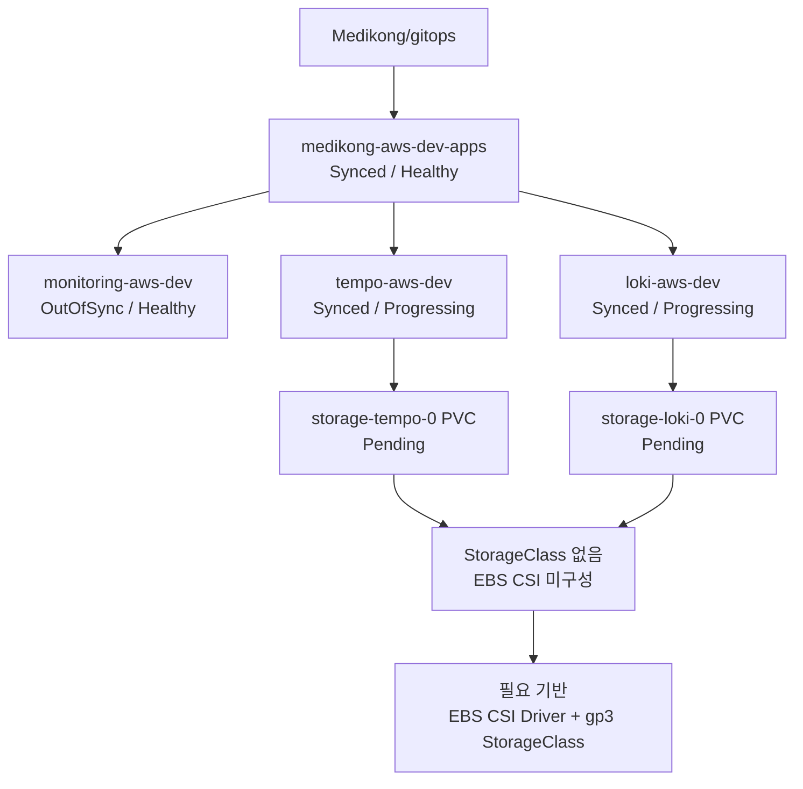

# aws-dev 관측성 배포 EBS StorageClass 부재

## 배경

aws-dev 클러스터에 Argo CD는 설치되어 있었지만, `Medikong/gitops` repo를 감시하는 Application은 아직 없었다. `gitops` repo에서 `task aws:bootstrap`을 AWS control plane에서 실행해 root Application인 `medikong-aws-dev-apps`를 등록했다.

배포 전 관측성 이미지 미러링 workflow는 `main` 기준으로 수동 실행했고 성공했다. 이 실행에서 ECR repository `grafana/loki`, `kiwigrid/k8s-sidecar`, `grafana/tempo`가 생성되고 이미지 push가 완료되었다.

## 현상

- 관찰된 현상:
  - `medikong-aws-dev-apps`는 `Synced / Healthy` 상태다.
  - `tempo-aws-dev`, `loki-aws-dev`는 `Synced / Progressing` 상태다.
  - `storage-loki-0`, `storage-tempo-0` PVC가 `Pending` 상태다.
  - `kubectl get storageclass` 결과가 `No resources found`다.
- 재현 조건:
  - aws-dev 클러스터에서 Argo CD root Application 등록 후 Tempo/Loki가 persistent volume을 요청한다.
- 기대 동작:
  - PVC 요청이 `gp3` 같은 StorageClass를 통해 EBS volume으로 동적 생성되고 Bound된다.
  - `loki-0`, `tempo-0` Pod가 Running 상태로 올라간다.
- 실제 동작:
  - PVC에 `StorageClass`가 지정되지 않았고, 클러스터에 기본 StorageClass도 없다.
  - scheduler가 `pod has unbound immediate PersistentVolumeClaims`로 Pod 배치를 보류한다.

## 영향

- 영향 범위:
  - aws-dev 관측성 backend 중 Loki/Tempo가 준비되지 않는다.
  - Grafana datasource 선언이 있어도 실제 log/trace backend가 준비되지 않아 관측성 검증이 막힌다.
  - 서비스 Application 상태와는 별개로 플랫폼 관측성 시나리오가 완료되지 않는다.
- 우선 처리 이유:
  - 관측성 배포는 이후 장애 분석, trace/log 검증, 발표 증거 확보의 선행 조건이다.
  - 이 문제는 애플리케이션 설정이 아니라 aws-dev 클러스터 storage substrate 부재에 가깝다.
- 우회 방법:
  - 임시 수동 PV 또는 local-path provisioner로 Pod를 띄울 수는 있지만, aws-dev 운영 경로로는 적절하지 않다.
  - aws-dev 기준으로는 EBS CSI Driver와 `gp3` StorageClass를 GitOps 관리 대상으로 추가하는 방향이 맞다.

## 해결 방안

해결 방향은 aws-dev 클러스터에 EBS 기반 동적 volume provisioning을 정식 platform 구성으로 추가하는 것이다. 수동 PV나 임시 local-path provisioner로 우회하지 않고, EBS CSI Driver와 `gp3` StorageClass를 GitOps 관리 대상으로 둔다.

필요한 작업 경계는 다음과 같다.

- `infra`: aws-dev node IAM role 또는 instance profile에 EBS CSI가 EBS volume을 생성, attach, detach, 삭제할 수 있는 권한을 부여한다.
- `gitops`: EBS CSI Driver Helm Application을 aws-dev platform Application으로 추가한다.
- `gitops`: 기본 `gp3` StorageClass YAML을 추가하고 Argo CD가 관리하게 한다.
- `gitops`: EBS CSI Driver와 StorageClass가 Tempo/Loki보다 먼저 sync되도록 sync wave를 조정한다.
- `gitops`: 기존 Pending PVC를 재생성하거나 재바인딩해 `storage-loki-0`, `storage-tempo-0`이 Bound 되는지 확인한다.

완료 기준은 `storage-loki-0`, `storage-tempo-0` PVC가 Bound 되고, `loki-0`, `tempo-0` Pod가 Running 상태가 되며, `loki-aws-dev`, `tempo-aws-dev` Application이 Healthy로 전환되는 것이다.

## 세부 내용

### 현재 구조

### 확인 내용

| 시간 | 확인 내용 | 결과 |
| --- | --- | --- |
| 2026-06-04 | `Observability Image Mirror` workflow를 `main`에서 `create_repositories=true`로 실행 | 성공. ECR repository와 Tempo/Loki 관련 이미지 push 완료 |
| 2026-06-04 | AWS control plane에서 Argo CD 설치 상태 확인 | `argocd` namespace와 `applications.argoproj.io` CRD 존재 |
| 2026-06-04 | `kubectl get applications -n argocd` 확인 | bootstrap 전에는 Application 없음 |
| 2026-06-04 | AWS control plane에서 `task aws:bootstrap` 실행 | `medikong-aws-dev-apps` root Application 등록 성공 |
| 2026-06-04 | `kubectl get applications -n argocd` 확인 | root Application은 `Synced / Healthy`, Tempo/Loki는 `Synced / Progressing` |
| 2026-06-04 | `kubectl get pvc -n observability` 확인 | `storage-loki-0`, `storage-tempo-0` 모두 `Pending` |
| 2026-06-04 | `kubectl get storageclass` 확인 | StorageClass 없음 |
| 2026-06-04 | `kubectl describe pvc -n observability` 확인 | `no persistent volumes available for this claim and no storage class is set` |

### 판단

현재 문제는 Tempo/Loki Helm values나 이미지 미러링 문제가 아니라, aws-dev Kubernetes 클러스터에 동적 EBS volume provisioning 기반이 없어서 발생한 것으로 판단한다.

임시 `kubectl apply`로 StorageClass만 만들기보다, 완성형 aws-dev 구조에 맞춰 다음 책임 경계로 처리한다.

- `infra`: EC2 node IAM role 또는 instance profile에 EBS CSI가 필요한 AWS 권한을 부여한다.
- `gitops`: EBS CSI Driver Helm Application과 `gp3` StorageClass를 YAML로 선언하고 Argo CD가 관리하게 한다.
- `workspace`: 현재 트러블 상태와 의사결정, 후속 작업 경계를 기록한다.

## 후속 작업

| 상태 | 작업 | 담당 | 링크 |
| --- | --- | --- | --- |
| done | 관측성 이미지 미러링 workflow를 `main`에서 재실행하고 성공 확인 | gitops | https://github.com/Medikong/gitops/actions/runs/26936454405 |
| done | AWS control plane에서 `task aws:bootstrap` 실행 후 Argo CD root Application 등록 확인 | gitops |  |
| done | Tempo/Loki PVC Pending 원인이 StorageClass 부재임을 확인 | workspace |  |
| todo | aws-dev node IAM role에 EBS CSI 권한 부여 방식 확정 | infra |  |
| todo | EBS CSI Driver Argo CD Application 설계 및 추가 | gitops |  |
| todo | `gp3` StorageClass YAML을 GitOps 관리 대상으로 추가 | gitops |  |
| todo | 기존 Pending PVC 재생성 또는 재바인딩 절차 결정 | gitops |  |
| todo | Loki/Tempo Pod Running, Application Healthy 검증 | gitops |  |

## 해결 상태

미해결. EBS CSI Driver와 기본 StorageClass가 준비된 뒤 `storage-loki-0`, `storage-tempo-0` PVC가 Bound되고 `loki-0`, `tempo-0` Pod가 Running 상태가 되는지 확인해야 한다.
