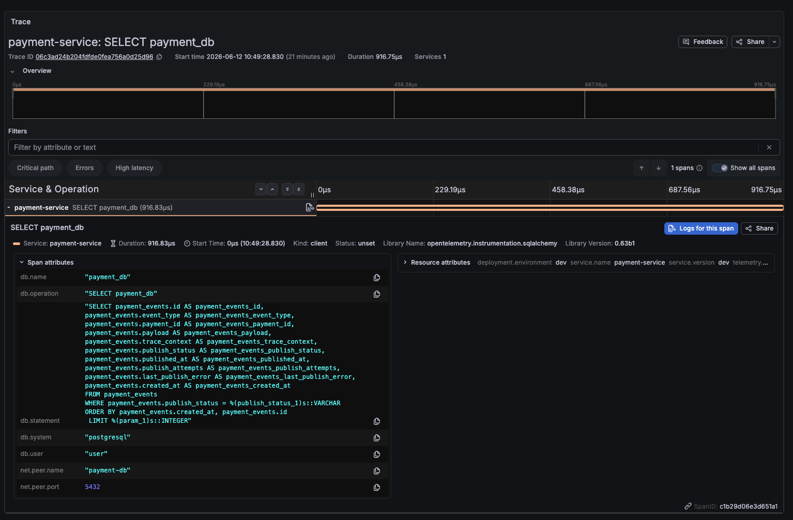
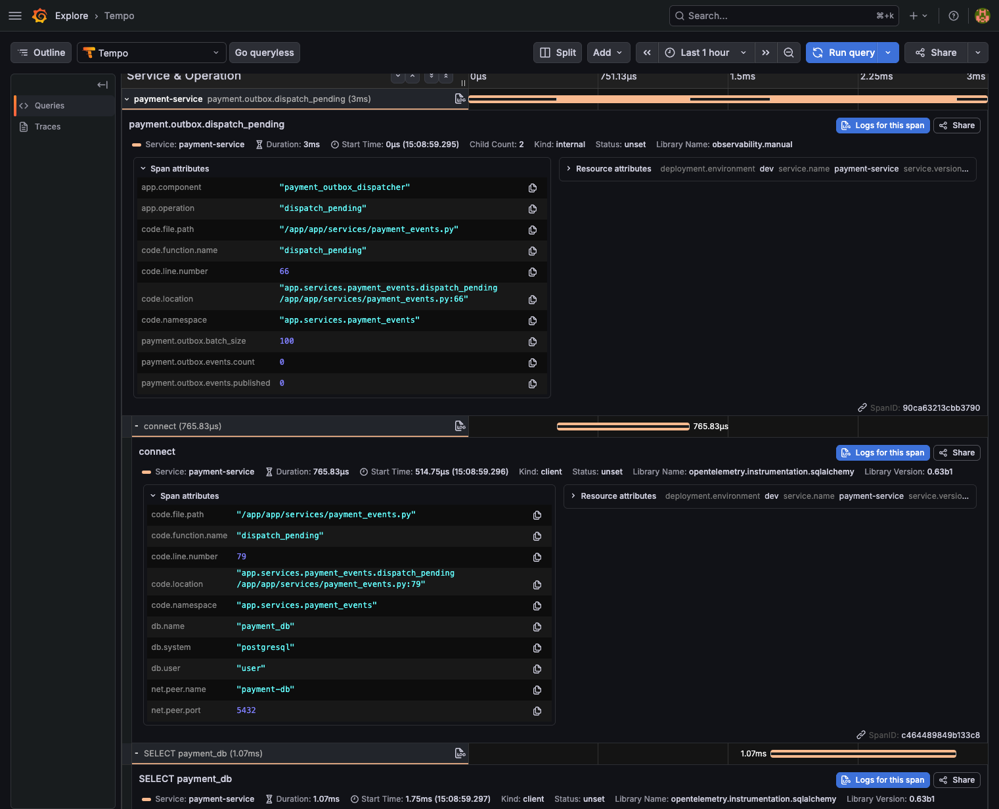

# payment outbox DB 단독 trace의 작업 맥락 부재

## Context

payment-service의 outbox dispatcher가 pending 이벤트를 조회하는 과정에서 OpenTelemetry SQLAlchemy instrumentation이 DB span을 수집했다. 수집 자체는 정상이다. 문제는 Tempo 화면에서 trace가 `payment-service: SELECT payment_db` 한 줄로만 보이고, 이 쿼리가 어떤 처리 과정에서 실행됐는지 판단하기 어렵다는 점이다.

이 기록은 DB 쿼리 trace가 "없는" 문제가 아니라, trace가 있어도 운영자가 의미를 해석하기 어려운 상태를 남긴다.

## Evidence

### Before

스크린샷에서 확인한 내용은 다음과 같다.

- trace 이름은 `payment-service: SELECT payment_db`이다.
- span은 1개뿐이며 service도 `payment-service` 1개만 보인다.
- library는 `opentelemetry.instrumentation.sqlalchemy`, version은 `0.63b1`이다.
- span kind는 `client`이고 status는 `unset`이다.
- `db.statement`는 `payment_events`에서 `publish_status = pending`인 row를 `created_at, id` 순으로 조회하는 SELECT이다.
- span attribute에는 DB 이름, DB operation, SQL statement, DB system, user, peer host/port는 있지만 처리 단계나 코드 위치는 없다.

### After

개선 후 스크린샷에서 확인한 내용은 다음과 같다.

- trace 이름은 `payment-service: payment.outbox.dispatch_pending`이다.
- 한 trace 안에서 `payment.outbox.dispatch_pending` 부모 span 아래에 connection과 `SELECT payment_db` span이 함께 보인다.
- 부모 span attribute에서 `app.component`, `app.operation`, `payment.outbox.batch_size`, `payment.outbox.events.count`를 확인할 수 있다.
- `code.location`으로 `app.services.payment_events.dispatch_pending /app/app/services/payment_events.py:79` 위치를 바로 찾을 수 있다.
- 이 캡처는 attribute 이름 정리 전 배포본이므로 `code.filepath`, `code.function`, `code.lineno`, `code.module` 이름이 함께 보인다. 다음 배포 후에는 `code.function.name`, `code.location`만 확인한다.

### Additional observation

notification-service의 `GET /notifications http send` span에서는 `code.location`이 `/opt/venv/bin/uvicorn:10`으로 붙고, 함수 위치도 `__main__.<module>`처럼 보였다. 이 위치는 애플리케이션 코드가 아니라 프로세스 런처이므로 조사에 도움이 되는 정보가 아니라 잡음에 가깝다.

이 관찰 때문에 callsite 판정은 파일 경로 allowlist나 `uvicorn` 개별 제외가 아니라 앱 module namespace allowlist로 제한한다. 앱 코드 위치를 확신할 수 없으면 거짓 위치를 붙이지 않고 `code.function.name`, `code.location`을 생략한다.

## Symptoms

- 관찰된 현상:
  - Tempo trace 목록과 상세 화면에서 `SELECT payment_db`만 보인다.
  - SQL을 자세히 읽어야 `payment_events` outbox 조회라는 점을 겨우 추론할 수 있다.
  - trace 화면만 보고는 "왜 실행됐는지", "어느 코드 경계에서 실행됐는지", "정상적인 background polling인지"를 바로 알기 어렵다.
- 재현 조건:
  - payment-service outbox dispatcher가 주기적으로 pending `payment_events` row를 조회한다.
  - 조회 시점에 HTTP request span이나 outbox dispatcher span 같은 상위 처리 span이 없다.
  - SQLAlchemy instrumentation이 DB client span만 생성한다.
- 기대 동작:
  - DB span이 `payment.outbox.dispatch_pending` 같은 상위 span 아래에 붙는다.
  - trace attributes에서 dispatcher, outbox, pending event 조회 같은 역할을 확인할 수 있다.
  - 가능하면 service/repository 경계 span이나 코드 위치 속성으로 실행 지점을 추적할 수 있다.
- 실제 동작:
  - DB span이 단독 trace처럼 보인다.
  - `db.statement` 외에는 작업 맥락을 설명하는 속성이 없다.

## Impact

- 영향 범위:
  - payment-service outbox dispatcher 관측.
  - Tempo에서 background 작업과 사용자 요청 trace를 구분하는 운영 경험.
  - 장애 조사 시 DB 쿼리의 의도와 코드 경계를 찾는 시간.
- 우선 처리 이유:
  - "trace가 수집된다"와 "trace를 보고 원인을 찾을 수 있다"는 다르다.
  - outbox polling은 정상 동작일 수도 있고, 장애 상황에서는 발행 지연의 단서일 수도 있다.
  - 단독 DB span만 남으면 정상 polling, 대량 pending 이벤트, publish 실패 재시도 중 무엇인지 빠르게 판단하기 어렵다.
- 우회 방법:
  - 현재는 SQL statement에서 `payment_events.publish_status = pending` 조건을 읽고 outbox dispatcher 조회라고 수동 추론한다.
  - service 로그와 같은 시간대의 `payment_event_dispatch_failed` 로그를 함께 찾는다.

## Investigation

| 시간 | 확인 내용 | 결과 |
| --- | --- | --- |
| 2026-06-12 10:49 | Tempo trace 상세 화면 확인 | `payment-service: SELECT payment_db` 단독 span 확인 |
| 2026-06-12 10:49 | span attribute 확인 | `db.statement`에 `payment_events` pending 조회 SQL이 있음 |
| 2026-06-12 | service 코드 확인 | `PaymentEventDispatcher.dispatch_pending()`이 pending outbox 이벤트를 조회함 |
| 2026-06-12 | 공통 DB 계측 확인 | `instrument_sqlalchemy_engine(engine)`이 SQLAlchemy DB span을 자동 생성함 |
| 2026-06-12 | 원인 판단 | background dispatcher에 상위 처리 span이 없어 DB span만 trace root처럼 노출됨 |
| 2026-06-12 | 코드 개선 | `payment.outbox.dispatch_pending`, `payment.outbox.dispatch_event` span 추가 |
| 2026-06-12 | 1차 테스트 확인 | observability 공통 테스트 23개, payment-service 테스트 14개 통과 |
| 2026-06-12 | 추가 코드 개선 | SQLAlchemy DB span에 callsite attribute를 붙이도록 공통 observability 패키지 보강 |
| 2026-06-12 | 추가 테스트 확인 | `Callsite` cache API와 span 시작 시점의 callsite attribute 부착을 observability 테스트로 검증 |
| 2026-06-12 15:27 | 개선 후 Tempo trace 확인 | dispatcher 부모 span 아래 connection과 `SELECT payment_db` span이 함께 보임 |
| 2026-06-12 | notification-service trace 확인 | `GET /notifications http send` span에 `__main__.<module> /opt/venv/bin/uvicorn:10` 런처 위치가 붙는 문제 확인 |
| 2026-06-12 | callsite 판정 기준 조정 | 기본 허용 module prefix를 `app`으로 두고, 필요하면 `OBSERVABILITY_CALLSITE_MODULE_PREFIXES`로 확장하기로 결정 |

## Decision

payment-service outbox dispatcher에 명시적인 trace span을 추가하고, SQLAlchemy DB span에는 실행 코드 위치를 나타내는 callsite attribute를 붙인다.

- `payment.outbox.dispatch_pending` span으로 pending event 조회와 batch dispatch의 부모 span을 만든다.
- `payment.outbox.dispatch_event` span으로 단일 이벤트 발행과 상태 갱신을 감싼다.
- trace attribute에는 고카디널리티 ID 대신 `app.component`, `app.operation`, `payment.event_type`, `payment.outbox.batch_size`, `payment.outbox.events.count`처럼 역할을 설명하는 값만 둔다.
- event id, payment id, reservation id 같은 값은 이번 개선에서 trace attribute로 넣지 않는다.

코드 위치 attribute는 공통 observability 패키지에서 자동으로 붙인다.

- callsite 값:
  - `Callsite`는 `namespace`, `function_name`, `file_path`, `line_number`를 가진 작은 값 객체로 둔다.
  - 합쳐진 문자열은 cache 값으로 보관하지 않고, `Callsite.location()`이 필요할 때 만든다.
- cache API:
  - 프로세스 메모리 안에만 있는 휘발성 cache API를 제공한다.
  - Redis 같은 외부 저장소까지 필요하지는 않다.
  - 기본 span 자동 부착 경로는 정확도를 위해 span 이름만으로 cache를 재사용하지 않는다.
  - 같은 코드 위치를 반복 탐색하는 비용이 커지면 code object나 statement fingerprint처럼 충돌이 적은 key를 따로 설계한다.
- trace attribute 출력:
  - trace attribute로 보낼 때는 `Callsite.location()`이나 `Callsite.as_trace_attributes()` 같은 메서드가 출력 형태를 만든다.
  - span에는 OpenTelemetry stable semantic convention 이름인 `code.function.name`을 기록한다.
  - Tempo에서 한 줄로 위치를 보기 쉽게 `code.location`도 함께 기록한다.
  - `code.namespace`, `code.file.path`, `code.line.number`는 `code.location`과 정보가 겹쳐 Tempo 화면을 복잡하게 만들 수 있으므로 trace attribute로 보내지 않는다.
- 적용 방식:
  - `configure_process_tracing()`이 `TracerProvider`에 `CallsiteSpanProcessor`를 등록한다.
  - SpanProcessor는 span 시작 시점에 실행 stack에서 앱 코드 frame을 찾고 `code.*` trace attribute를 붙인다.
  - 앱 코드 frame은 module이 허용 prefix와 같거나, 허용 prefix 뒤에 `.`이 이어지는 경우만 인정한다.
  - 기본 허용 prefix는 `app`이다.
  - 다른 top-level 앱 package가 생기면 `OBSERVABILITY_CALLSITE_MODULE_PREFIXES=app,worker,domain`처럼 comma-separated env로 확장한다.
  - 빈 env 값과 공백은 제거하고, 유효한 값이 없으면 기본 `app`을 사용한다.
  - `__main__`, `uvicorn`, `fastapi`, `starlette`, `sqlalchemy`, `opentelemetry`, stdlib, site-packages frame은 기본 allowlist에 걸리지 않으므로 자동으로 제외된다.
  - `/app/app`, `/app/services` 같은 파일 경로 allowlist는 운영자가 경로를 계속 관리해야 하므로 쓰지 않는다.
  - `uvicorn`만 특별히 막는 방식도 다른 런처나 wrapper에서 같은 문제가 반복될 수 있으므로 쓰지 않는다.
  - 허용 prefix에 맞는 frame을 못 찾으면 `code.function.name`, `code.location`을 붙이지 않는다.
  - SQLAlchemy DB span도 일반 span과 같은 경로로 코드 위치를 받으므로, 별도 SQLAlchemy 실행 훅에 의존하지 않는다.
  - 찾은 `Callsite`는 구조화 값으로 다루고, trace 전송 직전에만 문자열 `code.location`을 만든다.
- 공개 API:
  - 호출부가 전역 dict를 직접 만지지 않도록 패키지 레벨 함수로 감싼다.
  - 최소 API는 `get_callsite()`, `put_callsite()`, `list_callsites()`, `clear_callsite_cache()`로 둔다.
  - 필요하면 `delete_callsite()`를 추가하되, 초기 구현에서는 전체 clear와 list만으로도 운영 확인이 가능하다.

## Actions

| 상태 | 작업 | 담당 | 링크 |
| --- | --- | --- | --- |
| done | Tempo 화면에서 DB 단독 trace 증거 캡처 | observability | `assets/2026-06-12-payment-outbox-db-only-trace.png` |
| done | `payment_events` pending 조회 SQL임을 확인 | service | `services/payment-service/app/services/payment_events.py` |
| done | 트러블 문서로 문제 배경과 증거 기록 | workspace | 이 문서 |
| done | payment outbox dispatcher에 상위 처리 span 추가 | service | `services/payment-service/app/services/payment_events.py` |
| done | 단독 DB span이 dispatcher span 아래에 붙는지 테스트로 보강 | service | `services/payment-service/tests/test_payments.py` |
| done | background root span helper를 공통 observability 패키지에 추가 | service | `packages/observability/src/observability/tracing.py` |
| done | `Callsite` 값 객체와 인메모리 cache API 구현 | service | `packages/observability/src/observability/callsite.py` |
| done | 모든 span에 callsite attribute를 붙이는 SpanProcessor 구현 | service | `packages/observability/src/observability/tracing.py` |
| done | `Callsite.as_trace_attributes()` 출력 이름을 OpenTelemetry stable semantic convention에 맞춤 | service | `packages/observability/src/observability/callsite.py` |
| done | 화면 가독성을 위해 code attribute를 `code.function.name`, `code.location`으로 축소 | service | `packages/observability/src/observability/callsite.py` |
| done | `get_callsite()`, `put_callsite()`, `list_callsites()`, `clear_callsite_cache()` 테스트 추가 | service | `packages/observability/tests/test_observability.py` |
| done | SpanProcessor가 span에 `code.location`과 표준 `code.*` attribute를 붙이는지 테스트 보강 | service | `packages/observability/tests/test_observability.py` |
| done | 운영 화면에서 개선 후 Tempo trace를 다시 캡처 | observability | `assets/2026-06-12-payment-outbox-trace-after.png` |
| done | notification-service에서 런처 callsite가 잡힌 관찰을 기록 | workspace | 이 문서 |
| done | callsite 최종 판정을 앱 module prefix allowlist로 변경 | service | `packages/observability/src/observability/callsite.py` |
| done | `OBSERVABILITY_CALLSITE_MODULE_PREFIXES` 설정과 테스트 추가 | service | `packages/observability/src/observability/config.py` |
| todo | code attribute 축소 배포 후 Tempo에서 `code.function.name`, `code.location` 확인 | observability |  |
| todo | 같은 작업 span 안에서 여러 SQL 코드 경계가 섞이는지 운영 trace로 확인 | observability |  |

## Resolution

코드 레벨에서는 payment-service outbox dispatcher가 background root span을 만들고, SQLAlchemy DB span이 실행 코드 위치를 `code.*` attribute로 남기도록 보강했다. 운영 화면에서도 dispatcher 부모 span 아래에 connection과 `SELECT payment_db` span이 함께 잡히는 점을 확인했다. 이후 notification-service에서 런처 위치가 code attribute로 잡히는 문제가 보여, callsite 최종 판정은 앱 module prefix allowlist로 제한했다. 표준 attribute 이름 변경과 allowlist 적용 후 실제 Tempo 화면 확인은 아직 남아 있으므로 상태는 `in_progress`로 유지한다.

닫기 위한 조건은 다음과 같다.

- payment-service outbox dispatcher가 `payment.outbox.dispatch_pending` 같은 부모 span을 만든다.
- pending outbox 조회 DB span이 단독 trace가 아니라 dispatcher span의 child로 보인다.
- trace 화면에서 `code.location` 같은 attribute를 보고 실행 코드 위치를 바로 찾을 수 있다.
- code attribute 축소 배포 후 Tempo 화면에서 `code.function.name`, `code.location`을 확인한다.
