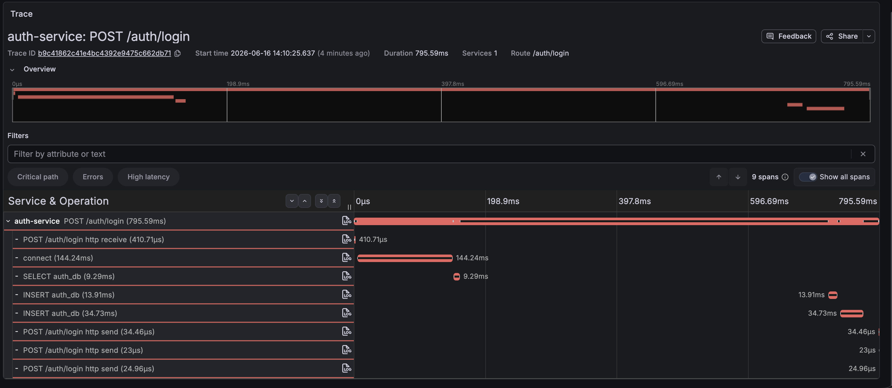
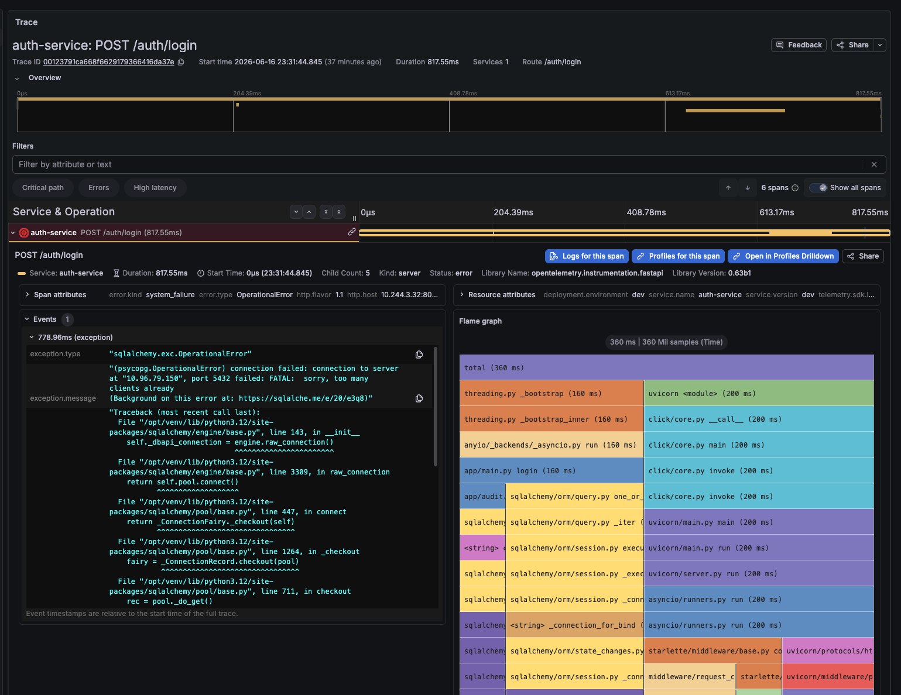

# 부하테스트 중 auth login trace의 미계측 지연 구간

## Context

`reservation-journey-load-test`로 auth-service 병목을 확인한 뒤 Tempo에서 느린 `/auth/login` trace를 확인했다.

기존 evidence에서는 50 VU 조건에서 auth-service가 CPU limit `500m` 근처까지 올라가고, `/auth/login` 응답 시간이 초 단위로 증가하며, readiness가 흔들린 뒤 Kong이 auth upstream target을 찾지 못하는 현상을 기록했다.

이번 기록은 그중 단일 `/auth/login` 요청의 trace를 더 자세히 본 것이다.




Pyroscope span profile을 켠 뒤 확인한 trace에서는 root span 내부에 flame graph와 exception event가 함께 붙었다. 이 trace는 `auth-service: POST /auth/login` duration `817.55ms`였고, exception event에는 PostgreSQL이 새 연결을 거절한 메시지가 기록됐다.



## Symptoms

- 관찰된 현상:
  - Tempo trace `b9c41862c41e4bc4392e9475c662db71`에서 `auth-service: POST /auth/login` duration이 `795.59ms`로 보였다.
  - trace 시작 시각은 `2026-06-16 14:10:25.637 KST`다.
  - span은 `auth-service` 하나에만 있고 downstream service 호출은 없다.
  - root span 내부의 표시된 DB 관련 span 합계는 전체 duration보다 훨씬 작다.
  - 추가 trace `00123791ca668f6629179366416da37e`에서 `auth-service: POST /auth/login` duration이 `817.55ms`로 보였다.
  - 같은 trace의 exception event에는 `(psycopg.OperationalError) connection failed ... FATAL: sorry, too many clients already`가 기록됐다.
- 재현 조건:
  - 로컬 Kubernetes에서 `reservation-journey-load-test`를 실행한다.
  - 시나리오는 iteration마다 준비된 customer pool 계정으로 `/auth/login`을 호출한다.
  - 부하 조건에서 auth-service login 요청이 몰린다.
- 기대 동작:
  - `/auth/login` latency가 커질 경우 trace에서 주요 지연 구간이 DB, 비밀번호 검증, token 발급, audit 기록, connection 대기 중 어디인지 분리되어야 한다.
- 실제 동작:
  - 현재 trace만으로는 root duration 중 상당 부분이 어느 코드 구간에서 발생했는지 보이지 않는다.

## Impact

- 영향 범위:
  - `reservation-journey-load-test` 결과 해석.
  - auth-service scale/resource 실험의 병목 판단.
  - `/auth/login` 최적화 우선순위 선정.
- 우선 처리 이유:
  - 단순히 DB span만 보면 DB가 병목처럼 보이지 않는다.
  - 단순히 root span만 보면 auth-service 전체가 느리다는 사실만 보이고, 실제 조치 지점이 불명확해진다.
  - login이 앞단에서 막히면 reservation/payment/ticket 서비스의 한계치를 측정하기 어렵다.
- 우회 방법:
  - 예매 서비스 한계 측정이 목적이면 login token pre-warm 또는 login 제외 시나리오를 별도로 둔다.
  - auth-service 병목 측정이 목적이면 login 포함 시나리오를 유지하되, `/auth/login` 내부 구간별 span을 추가한 뒤 재실행한다.

## Investigation

| 시간 | 확인 내용 | 결과 |
| --- | --- | --- |
| 2026-06-16 14:10 KST | Tempo trace 확인 | `auth-service: POST /auth/login`, trace id `b9c41862c41e4bc4392e9475c662db71`, duration `795.59ms` |
| 2026-06-16 14:10 KST | trace span 구성 확인 | `connect 144.24ms`, `SELECT auth_db 9.29ms`, `INSERT auth_db 13.91ms`, `INSERT auth_db 34.73ms` |
| 2026-06-16 14:10 KST | root duration과 표시 span 합계 비교 | DB/connect span 합계는 약 `202.17ms`, 전체 `795.59ms`와 약 `593ms` 차이 |
| 2026-06-16 KST | login 코드 경로 확인 | `db.query(User) -> verify_password() -> issue_token_response() -> record_audit()` |
| 2026-06-16 KST | password hash 설정 확인 | `PBKDF2-SHA256`, 기본 `AUTH_PASSWORD_ITERATIONS=210000` |
| 2026-06-17 KST | Tempo trace와 span profile 확인 | trace id `00123791ca668f6629179366416da37e`, duration `817.55ms`, flame graph `360ms` |
| 2026-06-17 KST | exception event 확인 | `psycopg.OperationalError`, PostgreSQL `FATAL: sorry, too many clients already` |
| 2026-06-17 KST | flame graph stack 확인 | `app/main.py login`, `sqlalchemy.orm`, `sqlalchemy.pool`, `psycopg.connection connect/wait_conn` 경로가 관측됨 |
| 2026-06-17 KST | 연결 예산 확인 | `auth-db max_connections=20`, `auth-service replicas=3`, 기존 SQLAlchemy 기본 pool은 Pod당 최대 `5 + 10 overflow`까지 연결 가능 |
| 2026-06-17 KST | concert-service 예외 확인 | `QueuePool limit of size 5 overflow 0 reached, connection timed out, timeout 5.00` |
| 2026-06-17 KST | local dev pool 조정 확인 | `database.sqlalchemy.poolSize=15`, `maxOverflow=5`, `poolTimeoutSeconds=10` |
| 2026-06-17 KST | local dev DB connection 한도 조정 확인 | 서비스별 Postgres `max_connections=80` |
| 2026-06-17 KST | `/auth/login` 전용 부하테스트 추가 | `auth-login-load-test`로 signup/setup 비용과 login 측정 구간을 분리 |
| 2026-06-17 KST | `verify_password()` child span 추가 | `auth.password.verify` span으로 PBKDF2 검증 구간을 root span 안에서 분리 |
| 2026-06-17 KST | auth login 단독 실행 결과 확인 | `POST /auth/login` 2093 requests, avg `22.08 rps`, error `0`, p95 `116.10ms`, p99 `512.67ms` |
| 2026-06-17 KST | Tempo sampling 설정 확인 | local Collector가 `baseline-traces`를 `25%`만 저장하고 있어 일부 로그 trace id가 Tempo에서 404 |
| 2026-06-17 KST | local Tempo sampling 수정 | `platform/observability/collector/values/local.yaml`의 `sampling_percentage`를 `100`으로 변경하고 Collector 재배포 |
| 2026-06-17 KST | 100% sampling 재검증 | 새 login trace `e31e5b52723b3d700e1444df12462d50`가 tail sampling/export 지연 후 Tempo에서 조회됨 |

## Current Reading

초기 trace만으로는 DB span 합계와 root duration 사이에 빈 구간이 커서 `PBKDF2` 비밀번호 검증을 가장 강한 가설로 보았다. 이후 span profile과 exception event를 함께 확인하면서 판단이 바뀌었다.

현재는 단일 원인보다 복합 병목으로 보는 편이 맞다. 그중 가장 직접적인 증거가 있는 축은 DB connection pool과 DB connection budget이다.

- DB query 자체는 단일 span 기준으로 `10~35ms` 수준이다.
- DB connection 관련 span은 `144.24ms`로 작지 않지만, 전체 `795.59ms`를 혼자 설명하지는 못한다.
- 새 trace에서는 connection 생성 과정에서 PostgreSQL이 `too many clients already`로 연결을 거절했다.
- flame graph는 `360ms`만 보여주며, 그중 `app/main.py login` 아래 SQLAlchemy/psycopg connection stack이 크게 보인다.
- `auth-db`의 `max_connections=20`에 비해 `auth-service replicas=3`과 SQLAlchemy 기본 pool 설정은 최대 `45`개 연결을 시도할 수 있었다.
- concert-service에서도 `QueuePool limit of size 5 overflow 0 reached`가 관측되어, auth-service만의 개별 코드 문제가 아니라 서비스 공통 DB pool 설정과 부하 조건의 문제로 볼 수 있다.
- 따라서 단순히 DB query가 느린 문제가 아니라, 서비스 replica 수, 애플리케이션 pool 크기, DB `max_connections`, HPA 반응 여부가 함께 맞아야 하는 구조다.
- `PBKDF2` 비밀번호 검증은 여전히 CPU 부담 후보지만, 이번 exception evidence 기준으로는 1차 원인이 아니라 2차 확인 대상이다.

정리하면, 부하테스트에서 `/auth/login` 요청이 몰리면 auth-service Pod들이 각자 DB pool을 확장하고, auth-db의 connection limit에 먼저 도달한다. 이때 connection checkout/connect가 지연되거나 실패하고, 일부 요청은 `OperationalError`로 끝난다. 그 결과 login latency와 error가 증가하고 readiness/Kong 503으로 이어진다.

## Connection Pool Reading

커넥션 풀 문제는 두 방향 모두를 같이 봐야 한다.

- pool이 너무 작으면 요청이 DB connection checkout에서 기다리다가 `QueuePool limit ... timed out`으로 실패한다.
- pool이 너무 크면 replica 수가 늘었을 때 서비스 전체가 DB `max_connections`를 초과해 `too many clients already`로 실패한다.
- 서비스별 데이터베이스가 분리되어 있으므로 모든 서비스의 pool을 과도하게 낮게 잡을 필요는 없다.
- 대신 서비스별 DB마다 `replicas * (pool_size + max_overflow)`가 해당 DB의 `max_connections`와 운영 여유분 안에 들어오는지 따로 계산해야 한다.
- local dev는 부하테스트 검증을 위해 서비스 공통 SQLAlchemy pool을 `15 + 5 overflow`, timeout `10s`로 올리고, 서비스별 Postgres `max_connections`를 `80`으로 올린 상태다.
- 이 조정은 병목 제거의 결론이 아니라 재실험을 위한 조건 정리다. 같은 부하에서 `QueuePool timeout`, `too many clients already`, `/auth/login` p95/p99, service별 API p95/p99가 줄어드는지 다시 확인해야 한다.

## Password Verify Reading

`auth-login-load-test`는 reservation journey에서 login만 떼어내기 위해 추가한 별도 시나리오다.

- setup 단계에서 customer pool을 `POST /auth/signup` 또는 기존 계정 login 검증으로 준비한다.
- 측정 구간에서는 `POST /auth/login`만 반복 호출한다.
- `loadtest_run_id`는 Job/Pod 실행 전체를 나타내고, per-iteration 고유값은 `iteration_id`와 request id에만 둔다.
- step-level summary는 `auth_login.login`만 기준으로 계산하므로 signup 비용이 `/auth/login` p95/p99에 섞이지 않는다.

전용 시나리오의 첫 빠른 ramp-up 결과는 다음과 같았다.

```json
{
  "event": "loadtest_api_summary",
  "loadtest_run_id": "read-api-loadtest-auth-login-load-test-manual-202606170202bv4sp",
  "step": "auth_login.login",
  "route": "POST /auth/login",
  "http_req_duration_p95_ms": 116.09880819999997,
  "http_req_duration_p99_ms": 512.6715732799997,
  "http_req_failed_rate": 0,
  "http_reqs_rate": 22.07929581390617,
  "http_reqs_count": 2093
}
```

이 결과는 0에서 60 login/s까지 빠르게 올렸을 때 실패 없이 통과했다는 의미다. 다만 p99가 `512ms`까지 올라가서 tail latency는 이미 보이기 시작했다. 이후 `verify_password()` 주변에 `auth.password.verify` child span을 추가하고 100% sampling 상태에서 다시 확인하니, root span의 빈 구간으로 보이던 부분 중 상당 비중이 PBKDF2 검증 구간으로 드러났다.

현재 auth-service의 password hash 설정은 `PBKDF2-SHA256`, 기본 `AUTH_PASSWORD_ITERATIONS=210000`이다. `/auth/login`은 요청마다 `hashlib.pbkdf2_hmac("sha256", ..., 210000)`을 한 번 실행한다. 이 작업은 의도적으로 CPU를 쓰는 보안 비용이므로, 단건 indexed user lookup보다 크게 보일 수 있다.

따라서 auth login 병목은 두 축으로 나눠서 읽어야 한다.

- DB connection budget 문제는 부하 조건에서 error와 connection 대기/실패를 만든다.
- PBKDF2 검증은 error가 없어도 `/auth/login` latency의 CPU-bound 하한선을 만든다.
- connection budget을 정리한 뒤에도 `auth.password.verify` p95/p99가 `/auth/login` p95/p99와 함께 움직이면 password verification CPU 비용이 남은 주요 병목으로 확정된다.

## Login Traffic Reading

로그인은 일반 read/write API와 같은 RPS 목표를 그대로 적용하기 어렵다.

- 일반 API는 로그인 이후 세션이나 토큰을 들고 여러 번 호출된다.
- `/auth/login`은 보통 사용자 세션 시작 시점에 1회 발생한다.
- 같은 사용자 규모라도 `/auth/login` RPS는 `/concerts`, `/reservations`, `/tickets/me`보다 낮게 잡는 것이 자연스럽다.
- 반대로 앱 재로그인, 토큰 정책 변경, 장애 복구, 이벤트 오픈 직전처럼 사용자가 한 번에 몰리는 상황은 별도 피크 조건으로 봐야 한다.
- 운영 판단은 평시 login RPS, 피크 login RPS, 실패 로그인 rate limit/backoff, auth-service CPU/replica 기준을 따로 둬야 한다.

이 문서의 목적은 `/auth/login`을 일반 API보다 가볍게 보는 것이 아니라, 성격이 다른 API로 분리해 용량과 방어 정책을 잡는 것이다. password verification은 보안상 필요한 비용이고, 부하테스트는 그 비용을 숫자로 드러내기 위한 수단이다.

## What Not To Conclude Yet

- 이 trace 하나만으로 DB query 자체가 느리다고 결론내리지 않는다.
- 이 trace 하나만으로 PBKDF2만 원인이라고 결론내리지 않는다.
- auth-service replica/CPU 증설 효과는 별도 run에서 같은 조건으로 비교해야 한다.
- Tempo root span의 빈 구간은 실제 idle일 수도 있고, 계측이 빠진 코드 구간일 수도 있다.
- connection pool 제한 이후 같은 부하에서 `too many clients already`가 사라지는지 재검증해야 한다.
- pool 크기 상향만으로 모든 병목이 해결됐다고 보지 않는다. connection checkout 대기, CPU, HPA, Kong upstream 상태를 같이 확인해야 한다.
- 60 login/s까지 실패가 없었다고 해서 login capacity가 충분하다고 결론내리지 않는다. 90/120 login/s 구간에서 p99, error rate, 목표 RPS 유지 여부를 다시 봐야 한다.
- `auth.password.verify`가 크다고 해서 운영 password iteration을 낮추는 결론으로 바로 이어가지 않는다. 보안 비용, 로그인 피크 가정, replica/CPU 비용을 함께 비교해야 한다.

## Decision

- 이 현상은 `TROUBLE-011`으로 분리해 추적한다.
- 주요 원인은 auth-service와 auth-db 사이의 connection budget 불일치로 보되, concert-service의 QueuePool timeout까지 포함해 서비스 공통 pool sizing 문제로 확장해서 본다.
- 우선 조치는 SQLAlchemy pool을 명시적으로 관리하고, 서비스별로 `replicas * (pool_size + max_overflow)`가 DB `max_connections`보다 작게 유지되도록 만드는 것이다.
- trace는 요청 전체 지연과 DB span 차이를 찾는 용도로 쓰고, Pyroscope span profile은 실제 stack과 connection 대기 위치를 확인하는 보조 근거로 사용한다.
- `/auth/login` 내부 span은 우선 `auth.password.verify`부터 추가해 root duration의 빈 구간을 줄인다.
- auth-service resource/replica 실험은 계속하되, 결과 해석 시 `/auth/login` p95/p99와 trace 내부 구간을 같이 본다.
- reservation/payment/ticket의 한계치를 보려는 실험은 login 포함 실험과 분리한다.
- login은 일반 API와 별도 용량 기준으로 본다. 평시/피크 login RPS와 실패 로그인 방어 정책을 따로 둔다.

## Actions

| 상태 | 작업 | 담당 | 링크 |
| --- | --- | --- | --- |
| done | 느린 `/auth/login` trace id와 캡처 기록 | workspace | 이 문서 |
| done | 기존 auth bottleneck evidence와 연결 | workspace | `docs/evidence/loadtest/reservation-journey-auth-bottleneck/README.md` |
| done | Pyroscope server와 Grafana datasource를 관측성 스택에 추가 | gitops | `gitops/platform/observability` |
| done | Python 서비스 공용 Pyroscope SDK push 연동 추가 | service | `service/packages/observability` |
| done | Pyroscope span profile에서 `/auth/login` stack 확인 | workspace | `assets/2026-06-17-auth-login-trace-flamegraph-too-many-clients.png` |
| done | PostgreSQL connection limit error 확인 | workspace | trace `00123791ca668f6629179366416da37e` |
| done | SQLAlchemy pool 기본값을 bounded pool로 변경 | service/gitops | `server.sqlalchemy`, `charts/medikong-service` |
| done | concert-service QueuePool timeout 확인 | workspace | `QueuePool limit of size 5 overflow 0 reached` |
| done | local dev SQLAlchemy pool과 Postgres connection 한도 상향 | gitops | `values/env/dev.yaml`, `platform/data/postgres.yaml` |
| done | auth login 전용 부하테스트 시나리오 추가 | gitops | `gitops/platform/loadtest/scenarios/auth-login-load-test.js` |
| done | `/auth/login` summary를 signup/setup과 분리 | gitops | `loadtest_api_summary`, `auth_login.login` |
| done | `verify_password()` child span 추가 | service | `auth.password.verify` |
| done | local dev Tempo baseline trace sampling 100% 적용 | gitops | `platform/observability/collector/values/local.yaml` |
| todo | bounded pool 적용 후 `reservation-journey-load-test` 재실행 | gitops/workspace | `gitops/platform/loadtest` |
| todo | 서비스별 DB pool budget 표 작성: replicas, HPA max, pool size, max overflow, DB max connections | workspace/gitops | 이 문서 |
| todo | DB pool 관측 지표 추가 검토: active/idle/checkout wait/timeout | service/workspace | `docs/architecture/observability/metrics/README.md` |
| todo | profile에서 `/auth/login` 잔여 CPU hotspot 확인: `_hashlib.pbkdf2_hmac`, token/audit 처리 구간 비교 | workspace | 이 문서 |
| todo | `/auth/login` 내부 span 확장 검토: user lookup, token issue, refresh token insert, audit insert/commit | service | `service/services/auth-service/app/main.py` |
| todo | password verification duration을 metric 또는 structured log로 기록 | service | `service/services/auth-service/app/security.py` |
| todo | auth-service CPU/replica/pool 조합별 동일 부하 재실행 | gitops | `gitops/values/services/auth.yaml` |
| todo | login 포함 run과 login 제외 또는 token pre-warm run을 분리해 비교 | gitops | `gitops/platform/loadtest` |
| todo | auth login 60/90/120 rps ramp-up 재실행 후 `auth.password.verify` p95/p99와 `/auth/login` p95/p99 비교 | gitops/workspace | `auth-login-load-test` |

## Resolution

미해결.

현상은 기록했고, 현재 1차 원인은 SQLAlchemy connection pool과 DB connection budget의 불일치로 좁혀졌다. local dev에서는 pool과 DB connection 한도를 재실험 가능한 값으로 조정했지만, 아직 해결로 보지는 않는다. 동일 부하에서 `too many clients already`, `QueuePool timeout`, `/auth/login` p95/p99, 서비스 API별 p95/p99, Kong 503, readiness 흔들림이 줄어드는지 확인한 뒤 닫는다.
