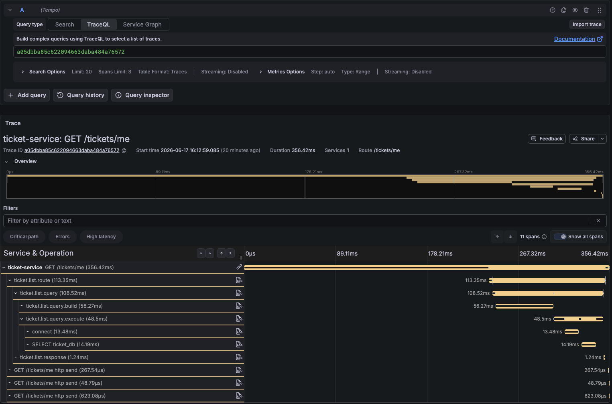
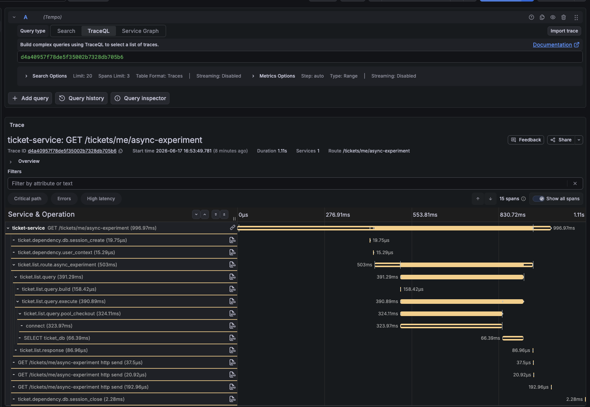
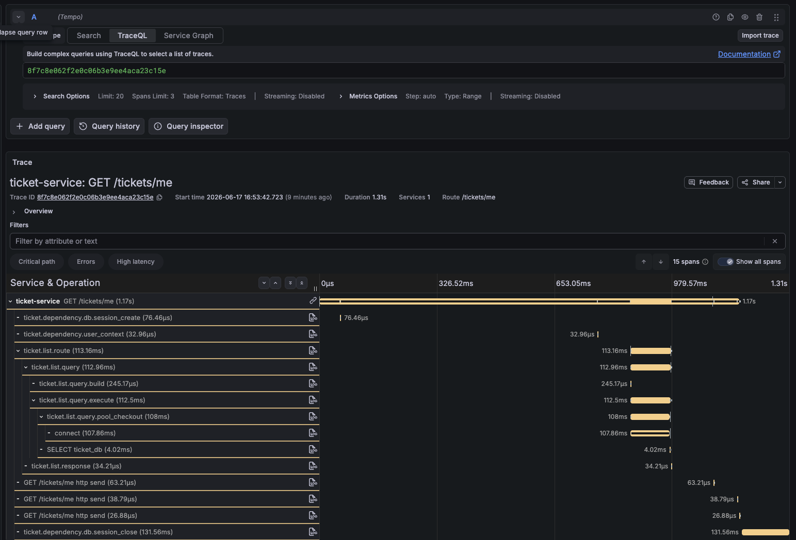
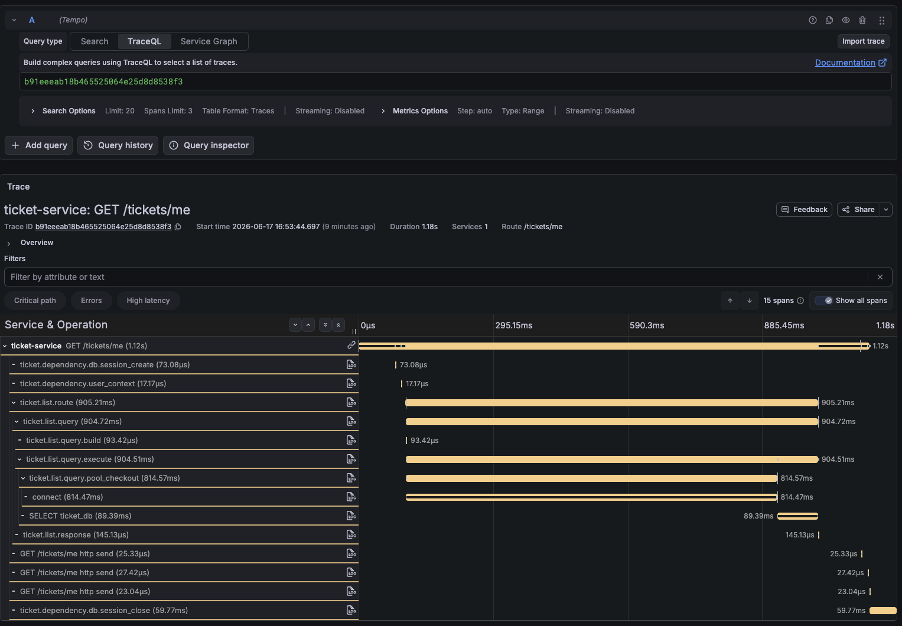

# 부하테스트 중 ticket-service /tickets/me 전체 목록 조회 과부하

## Context

`reservation-journey-load-test`를 로그인된 사용자 기준 예매 부하테스트로 바꾼 뒤 로컬 Kubernetes에서 실행했다.

실행 run id는 `read-api-loadtest-reservation-journey-lo-manual-20260617026xp6s`다. 시나리오는 `ramping-arrival-rate`로 6분 동안 `5 -> 10 -> 20 iterations/s`까지 증가했고, customer pool은 10명으로 설정되어 있었다.

결과 리포트는 `status: FAIL`이었다. 전체 `http_req_failed_rate`는 `5.10%`, 전체 p95는 `5011ms`, p99는 `10001ms`였다. API별로는 `reservation.create`와 `payment.approve`가 안정적이었지만 `reservation_journey.ticket.list`가 p95 약 `9998ms`, 실패율 `15.84%`를 기록했다.

동시에 `ticket-service` Pod 3개가 liveness probe 실패로 재시작됐다.

## Symptoms

- 관찰된 현상:
  - `ticket-service` Pod 3개가 재시작됐다.
  - Kubernetes event에는 `Liveness probe failed: Get "/health": context deadline exceeded`가 반복됐다.
  - `ticket-service` 컨테이너의 last state는 `Completed`, exit code `0`이었다.
  - 직전 로그에서 `/tickets/me` 요청 duration이 `10s~14s`까지 증가했다.
  - `/health`는 단순 응답인데도 duration이 `3s~4.5s`까지 밀렸다.
  - shutdown 중 Kafka consumer가 DB connection pool checkout에 실패했다.
- 재현 조건:
  - `reservation-journey-load-test`를 customer pool 10명으로 실행한다.
  - `ticket.wait` 단계가 `/tickets/me`를 2초 간격으로 최대 45초 동안 polling한다.
  - 기존 테스트 데이터가 남아 있어 사용자별 티켓 수가 계속 증가한다.
- 기대 동작:
  - `ticket.wait`는 방금 생성한 reservation의 ticket 발급 여부만 확인한다.
  - `/tickets/me`는 기본 20건, 최대 100건의 페이지 단위로 응답하고 다음 조회용 `nextCursor`를 제공한다.
  - ticket-service의 health endpoint는 부하 중에도 liveness timeout 안에 응답한다.
- 실제 동작:
  - `ticket.wait`가 `/tickets/me` 전체 목록을 받아 클라이언트에서 `reservationId`를 찾는다.
  - 같은 customer pool 계정을 반복 사용하면서 사용자별 ticket 목록이 1000건 이상으로 커졌다.
  - 전체 목록 조회와 JSON 직렬화가 누적되어 health 요청까지 지연됐다.

## Impact

- 영향 범위:
  - `reservation-journey-load-test` 결과 해석.
  - ticket-service의 실제 처리 한계 판단.
  - Loki/Tempo/Grafana 기반 부하테스트 관측.
  - ticket-service liveness 안정성.
- 우선 처리 이유:
  - 사용자별 티켓 1000건 이상은 현실적인 예매 테스트 데이터가 아니다.
  - 비현실적인 데이터 분포 때문에 `/tickets/me`가 실제보다 훨씬 무거운 API처럼 측정됐다.
  - ticket-service Pod 재시작으로 k6의 `http_status: 0` 실패가 발생했고, 전체 실험 결과가 오염됐다.
  - 페이지네이션 없는 목록 API는 실제 운영에서도 누적 데이터가 늘면 같은 문제가 반복될 수 있다.
- 우회 방법:
  - 재실행 전 ticket DB 또는 reservation journey dataset을 초기화한다.
  - customer pool 크기를 늘리거나 계정당 생성 ticket 수를 제한한다.
  - 임시로 `poll_seconds`와 `poll_interval_seconds`를 보수적으로 조정한다.
  - service/backend 한계 측정 전 observability 로그 조회 범위를 좁혀 Loki 추가 부하를 줄인다.

## Investigation

| 시간 | 확인 내용 | 결과 |
| --- | --- | --- |
| 2026-06-17 11:42 KST | 부하테스트 run report 확인 | `status: FAIL`, 전체 p95 `5011ms`, p99 `10001ms`, 실패율 `5.10%` |
| 2026-06-17 11:42 KST | API step summary 확인 | `ticket.list` p95 `9997.57ms`, p99 `10028.98ms`, 실패율 `15.84%`, 요청 수 `6333` |
| 2026-06-17 KST | `ticket-service` Pod 상태 확인 | 3개 Pod 모두 Running이지만 restart `2~3회` |
| 2026-06-17 KST | Kubernetes event 확인 | `/health` liveness/readiness probe가 context deadline exceeded로 실패 |
| 2026-06-17 KST | `ticket-service` previous log 확인 | `/tickets/me`가 `10s~14s`까지 지연, `/health`도 `3s~4.5s`까지 지연 |
| 2026-06-17 KST | shutdown stack trace 확인 | `QueuePool limit of size 15 overflow 5 reached, connection timed out, timeout 10.00` |
| 2026-06-17 KST | `ticket-db` 상태 확인 | DB Pod는 재시작 없음. 현재 connection은 idle 중심 |
| 2026-06-17 KST | ticket 데이터 분포 확인 | `tickets` 총 `15068건`, distinct user `10명` |
| 2026-06-17 KST | 사용자별 ticket 수 확인 | 사용자별 `1258~1659건` |
| 2026-06-17 KST | service 코드 확인 | `/tickets/me`는 `Ticket.user_id == user.user_id` 전체 결과를 `order_by(Ticket.id).all()`로 반환 |
| 2026-06-17 KST | loadtest 코드 확인 | `waitForTicket()`가 `/tickets/me` 전체 목록을 반복 조회한 뒤 `reservationId`를 클라이언트에서 검색 |

## Root Cause

이번 재시작은 ticket-service 컨테이너가 OOM이나 프로세스 예외로 직접 크래시난 현상이 아니다.

직접 원인은 `liveness probe` 실패다. ticket-service가 부하 중 `/health` 요청에 1초 안에 응답하지 못했고, kubelet이 컨테이너를 재시작했다.

근본 원인은 테스트 데이터셋과 API 형태가 맞물려 `/tickets/me`가 비현실적으로 무거워진 것이다.

현재 `reservation-journey-load-test`는 customer pool 10명을 반복 사용한다. 테스트가 여러 번 실행되면서 ticket DB에는 10명에게 `15068`개의 ticket이 쌓였고, 사용자별 ticket 수는 1000건을 넘었다.

그런데 `ticket.wait`는 방금 만든 reservation의 ticket 1건만 확인하면 되지만, 실제 구현은 다음 순서로 동작한다.

```text
GET /tickets/me
-> 해당 사용자의 전체 ticket 목록 반환
-> k6가 응답 배열에서 reservationId 일치 항목 검색
-> 없으면 2초 후 재시도
```

이 구조에서는 사용자별 ticket 수가 늘어날수록 매 polling 요청의 DB 조회, JSON 직렬화, network payload, k6 parsing 비용이 계속 증가한다. 부하테스트 후반에는 ticket-service가 `/tickets/me` 요청을 처리하느라 `/health`까지 지연했고, liveness probe가 실패했다.

shutdown 중 보인 `QueuePool limit of size 15 overflow 5 reached`는 별도 1차 원인이라기보다, 같은 시점에 HTTP 요청과 Kafka consumer가 DB connection pool을 함께 사용하면서 발생한 압박 증거로 본다.

## Decision

- 이번 결과는 ticket-service의 순수 처리 한계로 바로 해석하지 않는다.
- 사용자별 ticket이 1000건 이상 쌓인 데이터셋은 현실적인 reservation journey loadtest 조건이 아니다.
- `/tickets/me`는 페이지네이션 없이 전체 목록을 반환하므로 제품 API 관점에서도 개선이 필요하다.
- `ticket.wait`는 전체 목록 polling이 아니라 cursor pagination을 사용해 제한된 범위만 확인한다. reservation id 기준 ticket 확인 API는 필요하면 후속 작업으로 분리한다.
- 테스트 데이터셋은 실행마다 run id 기반 신규 customer pool을 만들고, 실제 부하에 참여하는 고객 수를 별도 설정으로 둔다. 1차 기준은 기본 pool 100명, 계정당 최대 100건 안쪽이다.
- 부하테스트 결과를 비교할 때는 customer pool size, 계정당 ticket 수, DB 초기화 여부를 실행 조건에 반드시 남긴다.

## Updated Test Method

초기 실패 이후 `reservation-journey-load-test`는 같은 시나리오 안에서도 실험 조건을 preset으로 분리해 실행한다.

핵심 변경은 다음과 같다.

- `PRESET` 이름으로 실험 조건을 선택한다. 예: `local-ticket-open-5m`, `mau10k-normal-peak`, `mau10k-ticket-open`, `stress-find-limit`.
- setup 단계에서 `loadtest_run_id` 기반 revision을 만들어 신규 customer pool과 신규 공연/회차/좌석 데이터셋을 준비한다.
- customer pool 전체 크기와 실제 부하에 참여하는 고객 수를 분리한다. 기본 customer pool은 100명 이상으로 두고, `activeCustomerCount`로 측정 구간의 고객 분산을 조절한다.
- `ticket.wait`는 `/tickets/me`를 무제한 전체 목록으로 보지 않고 `ticketListLimit`/`ticketListMaxPages` 범위 안에서 cursor pagination으로 확인한다.
- `loadtest_experiment_conditions`와 `loadtest_run_report`에 traffic model, customer pool, active customer count, dataset shape, ticket pagination 조건을 함께 남긴다.

`local-ticket-open-5m` 검증 조건은 다음과 같다.

| 항목 | 값 |
| --- | --- |
| scenario | `reservation-journey-load-test` |
| preset | `local-ticket-open-5m` |
| executor | `constant-arrival-rate` |
| rate / duration | `2 iterations/s`, `5m` |
| expected journeys | `600` |
| customer pool / active customer | `100 / 100` |
| dataset | `10` concerts, `20` performances, `6000` seats |
| `/tickets/me` 조회 범위 | `limit=20`, 최대 `5` pages |

이 조건은 운영 한계를 확정하기 위한 스트레스 테스트가 아니라, 오염된 데이터셋을 제거했을 때 ticket 목록 병목이 재현되는지 확인하는 로컬 검증용 preset이다.

## Follow-up Result

수정된 방식으로 `local-ticket-open-5m`를 실행한 결과 run id `read-api-loadtest-reservation-journey-lo-manual-2026061705rcvtw`는 `PASS`였다.

전체 결과:

| 지표 | 값 |
| --- | --- |
| status | `PASS` |
| iterations | `600` |
| overall p95 | `74.13ms` |
| overall p99 | `246.99ms` |
| error rate | `0%` |
| RPS | `13.32 req/s` |

API별 주요 결과:

| step | p95 | p99 | error rate | RPS | requests |
| --- | ---: | ---: | ---: | ---: | ---: |
| `reservation_journey.concerts` | `112.45ms` | `250.51ms` | `0%` | `1.81` | `600` |
| `reservation_journey.performances` | `32.95ms` | `137.87ms` | `0%` | `1.81` | `600` |
| `reservation_journey.seats` | `90.38ms` | `233.64ms` | `0%` | `1.81` | `600` |
| `reservation_journey.reservation.create` | `54.34ms` | `186.47ms` | `0%` | `1.81` | `600` |
| `reservation_journey.payment.approve` | `38.21ms` | `150.13ms` | `0%` | `1.81` | `600` |
| `reservation_journey.ticket.list` | `32.30ms` | `117.31ms` | `0%` | `3.61` | `1197` |

초기 실패 조건과 비교하면 `ticket.list`는 p95 약 `9998ms`, 실패율 `15.84%`에서 p95 `32.30ms`, 실패율 `0%`로 내려왔다. 이 차이는 ticket-service의 기본 처리 성능이 10초대였다는 뜻이 아니라, 초기 실험의 customer pool 재사용과 전체 목록 조회가 결과를 크게 왜곡했다는 근거다.

다만 이 결과만으로 `mau10k-ticket-open` 전체 조건이 통과한다고 볼 수는 없다. 로컬 5분 preset은 측정 조건을 정리한 뒤 병목이 사라지는지 확인하는 smoke에 가깝고, MAU 1만 가정의 티켓 오픈 검증은 observability 리소스와 report 수집 안정성을 확보한 뒤 별도 실행해야 한다.

## Additional Finding

후속 Tempo trace `aa8d8073907127c1dff17f6ea51b7ce2`에서는 `/tickets/me` 전체 duration이 `135.33ms`였지만 DB `SELECT ticket_db` span은 `645.21us`였다.

이 trace는 쿼리 자체보다 쿼리 이후의 애플리케이션 처리 구간이 튈 수 있음을 시사한다. 의심 구간은 SQLAlchemy 객체를 Pydantic/FastAPI 응답 모델로 변환하는 과정, JSON 직렬화, worker CPU 경합이다.

따라서 후속 관측에서는 `/tickets/me` 내부를 최소한 다음 두 단계로 나눠 본다.

- `ticket.list.query`: user id, cursor 조건, `limit + 1` 조회 구간.
- `ticket.list.response`: 조회 결과를 `TicketListResponse`로 조립하는 구간.

두 span이 모두 짧은데 root span만 길면 FastAPI 최종 response validation/serialization 또는 middleware/runtime 지연을 다음 후보로 본다.

이번 조사에서는 `ticket.list.route` span도 함께 본다.

- `ticket.list.query`: SQLAlchemy query와 `limit + 1` 조회 구간.
- `ticket.list.response`: SQLAlchemy 객체를 `TicketListResponse` item으로 조립하는 구간.
- `ticket.list.route`: FastAPI route 함수 안에서 service 호출을 감싸는 구간.

해석 기준은 다음과 같다.

| 관찰 | 우선 후보 |
| --- | --- |
| `ticket.list.query`가 길다 | DB index, cursor 조건, connection checkout, query 실행 |
| `ticket.list.response`가 길다 | Pydantic 모델 조립, 객체 attribute 접근, Python CPU 경합 |
| `ticket.list.route`는 짧고 HTTP root span만 길다 | FastAPI response validation/serialization, middleware/runtime, worker scheduling |
| 세 span이 모두 짧고 k6 step만 길다 | network/Kong/sidecar, client parsing, load generator saturation |

Grafana에서는 `Load 70 - Slow Trace Discovery`에서 `service=ticket-service`, `route=/tickets/me`, `min_duration_ms=100`으로 느린 요청 후보를 먼저 훑고, `trace_id` 링크로 Tempo Explore에 들어가 위 span들을 확인한다.

### 2026-06-17 추가 trace: query 내부 공백

Tempo trace `4fb0fcb4baed05705312683d654cb7e5`는 `/tickets/me` 전체 duration이 `425.35ms`였지만 DB `SELECT ticket_db` span은 `5.50ms`였다.
이 trace는 SQL 실행 자체가 아니라 SQLAlchemy/런타임 진입 전후의 대기 구간을 더 의심하게 만든다.

주요 분해는 다음과 같다.

| 구간 | duration/gap |
| --- | ---: |
| root `GET /tickets/me` | `425.35ms` |
| root 시작 후 `ticket.list.route` 시작 전 | `18.76ms` |
| `ticket.list.route` | `290.07ms` |
| route 내부에서 `ticket.list.query` 시작 전 | `117.47ms` |
| `ticket.list.query` | `170.17ms` |
| query 내부에서 DB `connect` 시작 전 | `140.10ms` |
| DB `connect` | `10.64ms` |
| DB `SELECT ticket_db` | `5.50ms` |
| `ticket.list.response` | `0.56ms` |
| route 종료 후 첫 `http send` 전 | `92.57ms` |

따라서 다음 실험에서는 `ticket.list.query`를 다시 `ticket.list.query.build`, `ticket.list.query.execute`, `ticket.list.query.returned`로 나눠 본다.
`ticket.list.query.execute`가 길지만 DB `connect`/`SELECT` span이 짧으면 SQLAlchemy pool checkout, DBAPI 진입 전 대기, Python thread scheduling을 우선 후보로 둔다.
반대로 `ticket.list.query.execute` 자체가 짧고 root span만 길면 FastAPI response validation/serialization, middleware, network/Kong/sidecar 쪽을 본다.

### 2026-06-17 추가 trace: route 진입 전 공백

Tempo trace `de4b0824a4405fa3732430c01e750502`에서는 `/tickets/me` 전체 duration이 `202.16ms`였지만 `ticket.list.route`는 `16.87ms`, `ticket.list.query`는 `15.76ms`였다.
DB `connect`는 `3.40ms`, DB `SELECT ticket_db`는 `5.23ms`, `ticket.list.response`는 `581.71us`였다.

같은 유형의 추가 캡처인 Tempo trace `a05dbba85c622094663daba484a76572`에서는 `/tickets/me` 전체 duration이 `356.42ms`, `ticket.list.route`가 `113.35ms`, `ticket.list.query`가 `108.52ms`였다.
이 캡처는 HTTP root span 안에서 route/query 하위 span이 뒤쪽에 몰려 보이는 현상을 눈으로 확인하기 위한 증거다.



이 trace에서 약 `180ms`는 HTTP root span이 시작된 뒤 `ticket.list.route`가 시작되기 전 구간에 있다.
`ticket.list.route`는 FastAPI route 함수 본문 첫 부분에서 시작하므로, 이 공백은 ticket-service 비즈니스 로직이나 SQL 실행 구간이 아니라 route 함수 본문에 들어오기 전의 FastAPI 처리 구간으로 본다.

현재 우선 후보는 다음과 같다.

- FastAPI/Starlette middleware 체인에서 `call_next`까지 도달하기 전 대기.
- query parameter parsing/validation.
- `Depends(get_db)`, `Depends(get_user_context)` dependency resolve.
- sync route 함수 실행을 위한 AnyIO threadpool worker scheduling 또는 worker token 대기.
- OpenTelemetry/FastAPI instrumentation, Pyroscope span profile correlation 처리 비용.

이 단계에서는 특정 원인을 확정하지 않는다.
다만 `get_db()`의 `SessionLocal()`은 일반적으로 실제 DB connection checkout을 query 실행 시점까지 늦추므로, 이 `180ms`를 DB pool wait로 바로 해석하지 않는다.
Kong 대기도 우선 후보에서 낮게 본다. 이 root span은 ticket-service 프로세스 안에서 시작된 server span이고, 이미 Kong에서 ticket-service로 요청이 넘어온 뒤의 시간만 포함하기 때문이다.

참고로 kt cloud의 FastAPI/Robyn 비교 글을 정리한 외부 레퍼런스에서도 FastAPI가 고동시성 조건에서 평균보다 p95/p99 tail latency가 크게 튀는 현상을 주요 문제로 다룬다.
이 문서는 현재 trace의 원인을 확정하는 근거가 아니라, Python/FastAPI 계열에서 tail latency가 구조적으로 커질 수 있다는 배경 근거로만 사용한다.
참고: [왜 kt cloud는 FastAPI 대신 Robyn을 선택했을까?](https://lms0806.tistory.com/333)

### 2026-06-17 sync/async 비교 실험 결과

`/tickets/me`의 route 진입 전 공백이 sync endpoint의 AnyIO threadpool scheduling 때문인지 확인하기 위해 같은 ticket-service Pod에 직접 요청을 넣어 비교했다.
Kong과 load generator network 변수를 줄이기 위해 `kubectl port-forward svc/ticket-service 18085:8085`로 ticket-service에 직접 접근했다.

비교 대상은 다음 두 경로다.

| 구분 | path | 구현 차이 |
| --- | --- | --- |
| sync | `/tickets/me?limit=10` | FastAPI sync route. route 함수와 sync dependency가 AnyIO threadpool에서 실행된다. |
| async experiment | `/tickets/me/async-experiment?limit=10` | FastAPI async route. route 본문은 event loop에서 시작하고, 기존 sync SQLAlchemy 작업만 `run_in_threadpool()`로 넘긴다. |

실험 조건은 다음과 같다.

| 항목 | 값 |
| --- | --- |
| run id | `codex-threadpool-1781682815678449000` |
| user id | `loadtest-ticket-read-v1-customer-000001` |
| headers | `X-User-Id`, `X-User-Role` |
| warmup | sync 20 requests, async 20 requests, concurrency 5 |
| measurement | sync 240 requests, async 240 requests, sync2 240 requests, async2 240 requests |
| concurrency | 40 |
| 실패 | 모든 구간 `0`건 |

서버 access log 기준 결과는 다음과 같다.

| 구간 | route | count | avg | p50 | p95 | p99 | max |
| --- | --- | ---: | ---: | ---: | ---: | ---: | ---: |
| warmup-sync | `/tickets/me` | 20 | `118.3ms` | `86.5ms` | `279.2ms` | `282.2ms` | `283ms` |
| warmup-async | `/tickets/me/async-experiment` | 20 | `41.6ms` | `29.5ms` | `84.2ms` | `87.2ms` | `88ms` |
| sync | `/tickets/me` | 240 | `503.7ms` | `423.5ms` | `994.5ms` | `1078.5ms` | `1099ms` |
| async | `/tickets/me/async-experiment` | 240 | `485.2ms` | `426.0ms` | `776.1ms` | `909.2ms` | `970ms` |
| sync2 | `/tickets/me` | 240 | `463.3ms` | `409.0ms` | `869.0ms` | `922.1ms` | `1092ms` |
| async2 | `/tickets/me/async-experiment` | 240 | `449.8ms` | `395.0ms` | `907.1ms` | `996.0ms` | `1024ms` |

상위 느린 trace 12개씩을 Tempo API로 다시 분해한 결과는 다음과 같다.
`call_to_route`는 `http.request.middleware.call_next.start` event부터 `ticket.list.route` 또는 `ticket.list.route.async_experiment` span 시작까지의 시간이다.

| 구간 | trace count | server avg | root avg | call_to_route avg | call_to_route max | query avg | pool checkout avg | SELECT avg |
| --- | ---: | ---: | ---: | ---: | ---: | ---: | ---: | ---: |
| sync | 12 | `1044.0ms` | `1108.0ms` | `718.7ms` | `872.3ms` | `243.1ms` | `208.9ms` | `27.9ms` |
| async | 12 | `845.3ms` | `877.9ms` | `342.3ms` | `432.5ms` | `336.6ms` | `251.9ms` | `84.0ms` |
| sync2 | 12 | `917.7ms` | `948.1ms` | `169.9ms` | `514.1ms` | `561.6ms` | `429.0ms` | `125.8ms` |
| async2 | 12 | `957.3ms` | `1057.4ms` | `285.8ms` | `706.0ms` | `407.5ms` | `184.7ms` | `221.8ms` |

이 결과에서 route 진입 전 공백은 sync route에서 더 크게 튀었다.
특히 첫 sync 측정 구간의 tail trace 12개 평균은 `call_to_route`가 `718.7ms`였고, async experiment는 `342.3ms`였다.
따라서 `/tickets/me`의 pre-route 공백은 FastAPI sync endpoint가 AnyIO threadpool worker를 기다리는 구조와 잘 맞는다.

다만 async experiment도 전체 tail latency가 사라지지는 않았다.
async route는 route 본문을 event loop에서 시작하지만, 실제 SQLAlchemy 작업은 여전히 `run_in_threadpool()`로 넘긴다.
따라서 threadpool 부담이 없어진 것이 아니라 route span 안쪽의 `ticket.list.query`와 `ticket.list.query.pool_checkout`로 이동해 보인다.

대표 trace는 다음과 같다.

#### async experiment: `d4a40957f78de5f35002b7328db705b6`



| 구간 | 값 |
| --- | ---: |
| route | `/tickets/me/async-experiment` |
| server log duration | `935ms` |
| Tempo root duration | `997.0ms` |
| `call_next.start -> route.async_experiment start` | `432.4ms` |
| `ticket.list.route.async_experiment` | 약 `503ms` |
| `ticket.list.query` | `391.3ms` |
| `ticket.list.query.pool_checkout` | `324.1ms` |
| DB `SELECT ticket_db` | `66.4ms` |

이 trace는 async route에서도 tail이 남는 사례다.
하지만 route span이 시작된 뒤 `query.pool_checkout`과 DB connect/SELECT가 대부분을 차지하므로, 순수 route 진입 전 공백만의 문제는 아니다.

#### sync pre-route tail: `8f7c8e062f2e0c06b3e9ee4aca23c15e`



| 구간 | 값 |
| --- | ---: |
| route | `/tickets/me` |
| server log duration | `1090ms` |
| Tempo root duration | `1168.1ms` |
| `call_next.start -> ticket.list.route start` | `863.9ms` |
| `ticket.list.route` | 약 `113ms` |
| `ticket.list.query` | `113.0ms` |
| `ticket.list.query.pool_checkout` | `108.0ms` |
| DB `SELECT ticket_db` | `4.0ms` |

이 trace는 이번 실험에서 가장 중요한 증거다.
DB `SELECT`는 `4.0ms`로 짧고, query 전체도 `113.0ms`인데 root duration은 `1s`를 넘는다.
긴 시간의 대부분은 `call_next.start` 이후 route 함수 본문이 시작되기 전의 `863.9ms` 공백에 있다.
이 구간은 ticket-service 비즈니스 로직이나 실제 SQL 실행 이전이므로, sync route/dependency를 AnyIO threadpool에 배치하기 전의 scheduling 또는 worker token 대기 가능성이 높다.

#### sync pool checkout tail: `b91eeeab18b465525064e25d8d8538f3`



| 구간 | 값 |
| --- | ---: |
| route | `/tickets/me` |
| server log duration | `1099ms` |
| Tempo root duration | `1120.7ms` |
| `call_next.start -> ticket.list.route start` | `103.0ms` |
| `ticket.list.route` | 약 `905ms` |
| `ticket.list.query` | `904.7ms` |
| `ticket.list.query.pool_checkout` | `814.6ms` |
| DB `SELECT ticket_db` | `89.4ms` |

이 trace는 다른 유형의 tail이다.
route 진입 전 공백은 `103.0ms`로 상대적으로 작고, 대부분은 route 내부의 `query.pool_checkout`에서 발생했다.
따라서 전체 latency 문제를 threadpool scheduling 하나로만 설명하면 안 된다.
DB query 자체보다 SQLAlchemy connection checkout/DB connect 대기가 더 큰 비중을 차지한다.

#### 결론

`/tickets/me`의 느린 trace는 두 유형으로 나뉜다.

| 유형 | 대표 trace | 주요 공백 | 해석 |
| --- | --- | --- | --- |
| pre-route scheduling tail | `8f7c8e062f2e0c06b3e9ee4aca23c15e` | `call_next.start -> route start` `863.9ms` | FastAPI sync route/dependency가 AnyIO threadpool worker를 기다리는 문제로 본다. |
| pool checkout tail | `b91eeeab18b465525064e25d8d8538f3` | `ticket.list.query.pool_checkout` `814.6ms` | SQL 문장 실행보다 SQLAlchemy connection checkout/DB connect 대기가 크다. |
| async comparison tail | `d4a40957f78de5f35002b7328db705b6` | route 내부 `query.pool_checkout` `324.1ms` | async route로 바꿔도 sync SQLAlchemy 작업은 threadpool/pool wait 영향을 계속 받는다. |

따라서 의심했던 원인에 대한 결론은 다음과 같다.

- `DB SELECT` 자체가 주원인이라고 보기는 어렵다. 대표 pre-route tail에서 `SELECT`는 `4.0ms`에 불과했다.
- `/tickets/me`의 route 진입 전 공백은 Python/FastAPI sync endpoint 구조, 특히 AnyIO threadpool scheduling 또는 worker token 대기 영향으로 보는 것이 맞다.
- 전체 tail latency는 두 층으로 봐야 한다. route 진입 전에는 FastAPI/AnyIO threadpool scheduling, route 내부에서는 SQLAlchemy pool checkout/DB connect 대기가 주요 원인이다.
- async route 비교 실험은 threadpool scheduling 의심을 강화했다. 다만 완전한 해결책은 단순히 route만 async로 바꾸는 것이 아니라, DB 작업을 어떻게 격리할지까지 함께 봐야 한다.

## Ticket-Service Read Scenario

`ticket-service-read-load-test`는 reservation journey의 축소판이 아니다.
목적은 ticket-service `/tickets/me` read path의 tail latency 원인을 분리하는 것이다.

setup 단계는 run id 기반 customer pool을 만들고 `/tickets/issue`로 customer별 ticket 목록을 준비한다.
측정 단계는 다음 세 step만 순차 실행한다.

| step | 동작 | 확인 포인트 |
| --- | --- | --- |
| `ticket-list` | `/tickets/me` 첫 페이지 조회 | 첫 페이지 p95/p99, error rate, RPS |
| `ticket-list-pagination` | `nextCursor`로 설정된 page depth만큼 조회 | cursor pagination 누적 비용 |
| `ticket-wait-by-list` | 설정된 `reservationId`의 ticket을 pagination으로 찾기 | reservation journey의 ticket wait와 같은 read pattern |

RPS, duration, VU, local/cluster 조건은 scenario 코드가 아니라 `gitops/platform/loadtest/values/scenarios/ticket-service-read-load-test.yaml` 또는 `values/presets/ticket-service-read/*.yaml`에서 관리한다.
`limit`, pagination page depth, wait target ticket position, customer별 ticket 수, active customer 수 역시 values로 둔다.

리포트에서는 `loadtest_run_report.api_step_results[].step`에서 `ticket-list`, `ticket-list-pagination`, `ticket-wait-by-list`를 따로 본다.
처리량은 기존 `http_reqs_rate`와 사람이 읽기 쉬운 `rps`가 함께 남는다.

## Pyroscope Check

repo 기준으로 Pyroscope 경로는 존재한다.

- service 코드: 각 서비스의 `configure_app_observability()`가 `configure_process_profiling(config)`와 `configure_process_tracing(config)`를 호출한다.
- observability package: `PYROSCOPE_ENABLED=true`이고 `PYROSCOPE_SERVER_ADDRESS`가 있을 때 process-level profiler가 켜진다.
- span/profile correlation: `PYROSCOPE_ENABLED=true`와 `PYROSCOPE_SPAN_PROFILES_ENABLED=true`가 동시에 필요하다.
- backend: `gitops/argo/applications/aws-dev/platform/pyroscope.yaml`가 Pyroscope Helm release를 `observability` namespace에 배포한다.
- aws-dev env: `gitops/values/env/aws-dev.yaml`은 profiling enabled, server address, sample rate 25를 설정하지만 spanProfilesEnabled는 false다.

따라서 aws-dev에서 process-level profile 자체가 안 보이면 우선 배포/env 문제를 본다.
`ticket-aws-dev` Application은 `values/base.yaml`, `values/env/aws-dev.yaml`, `values/services/ticket.yaml`, `values/overrides/aws-dev-smoke-stable.yaml` 순서로 병합된다.
현재 `values/services/ticket.yaml`과 `aws-dev-smoke-stable` override는 profiling을 끄지 않으므로, values 기준으로는 ticket-service Pod에 `PYROSCOPE_ENABLED=true`와 `PYROSCOPE_SERVER_ADDRESS=http://pyroscope.observability.svc.cluster.local:4040`가 들어가야 한다.

반대로 Tempo span에서 Pyroscope profile 링크가 기대처럼 보이지 않는 것은 현재 설정만으로는 정상이다.
aws-dev의 `observability.profiling.spanProfilesEnabled`가 false라 `pyroscope-otel` span processor가 붙지 않는다.
API별 trace에서 profile로 바로 넘어가려면 부하 구간에만 `spanProfilesEnabled=true`와 낮은 cardinality tag(`scenario`, `run_id`)를 override해야 한다.

## Actions

| 상태 | 작업 | 담당 | 링크 |
| --- | --- | --- | --- |
| done | ticket-service Pod 재시작 원인 확인 | workspace | 이 문서 |
| done | `/tickets/me` latency와 liveness probe 실패 연결 | workspace | 이 문서 |
| done | ticket DB의 사용자별 ticket 수 분포 확인 | workspace | 이 문서 |
| done | loadtest `ticket.wait`가 `/tickets/me` 전체 목록을 polling하는 구조 확인 | workspace | `gitops/platform/loadtest/flows/reservation-journey.js` |
| done | `/tickets/me`에 페이지네이션 추가 | service | `service/services/ticket-service/app/routers/tickets.py` |
| done | ticket 목록 response schema와 OpenAPI 문서 갱신 | service/workspace | `workspace/docs/project_docs/02-service-architecture/openapi/services/ticket-service/paths/tickets_me.yaml` |
| todo | reservation id 기준 ticket 조회 또는 ticket wait 전용 확인 API 검토 | service/gitops | `ticket.wait` |
| done | reservation journey 테스트 데이터셋에 계정당 ticket 상한 추가 | gitops | `gitops/platform/loadtest` |
| done | 실행마다 run id 기반 신규 customer pool 생성 | gitops | `reservation-journey-load-test` |
| done | `loadtest_experiment_conditions`에 customer pool size와 active customer count 기록 | gitops | `loadtest_run_report` |
| done | 신규 방식 `local-ticket-open-5m`로 오염 제거 후 ticket 목록 병목 재검증 | gitops/workspace | `read-api-loadtest-reservation-journey-lo-manual-2026061705rcvtw` |
| todo | `mau10k-ticket-open` 조건을 observability 리소스 안정화 후 재실행 | gitops/workspace | `reservation-journey-load-test` |
| done | `/tickets/me` 응답 조립/직렬화 구간 trace 보강 | service/workspace | `ticket.list.query`, `ticket.list.response`, `ticket.list.route` |
| done | ticket-service read path 독립 부하테스트 시나리오 추가 | gitops/workspace | `ticket-service-read-load-test` |
| done | `/tickets/me` sync route와 async experiment route 비교 실험으로 pre-route 공백 원인 분리 | service/workspace | `codex-threadpool-1781682815678449000` |
| todo | `ticket-service-read-load-test`를 local smoke와 aws-dev 조건에서 실행해 step별 p95/p99/RPS를 비교 | gitops/workspace | `ticket-list`, `ticket-list-pagination`, `ticket-wait-by-list` |

## Resolution

부분 해결. 초기 장애의 1차 원인은 데이터셋 오염과 페이지네이션 없는 ticket 목록 API가 결합된 것으로 본다.
후속 trace 실험에서는 `/tickets/me` tail latency가 순수 DB `SELECT`보다 Python/FastAPI sync route의 AnyIO threadpool scheduling, SQLAlchemy connection pool checkout, DB connect 대기에 더 가깝다는 결론을 얻었다.

후속 조치는 세 갈래다.

1. 제품 API: `/tickets/me`는 `limit`/`cursor`를 받고 `items`/`nextCursor`로 응답한다.
2. 부하테스트: 실행마다 run id 기반 신규 customer pool을 만들고, `customerPool.size`와 `activeCustomerCount`를 분리해 현실적인 사용자 분포를 보장한다.
3. 관측: `/tickets/me`에서 DB query와 response 조립 구간을 분리해, 쿼리가 아닌 코드 레벨 지연 여부를 확인한다.

`local-ticket-open-5m`에서는 `reservation_journey.ticket.list`가 p95 `32.30ms`, p99 `117.31ms`, 실패율 `0%`로 안정화됐다. 해결 완료 판단은 `mau10k-ticket-open` 또는 그에 준하는 ticket-open preset을 다시 실행해 ticket-service Pod 재시작이 사라지고, API별 p95/p99와 실패율이 기준 안에 들어오는지 확인한 뒤 내린다.
